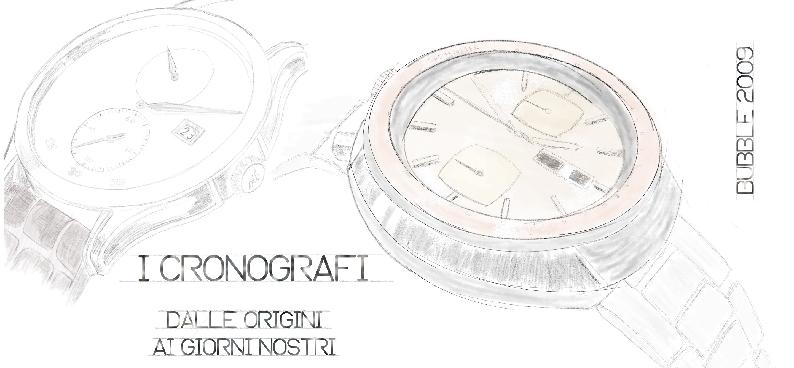
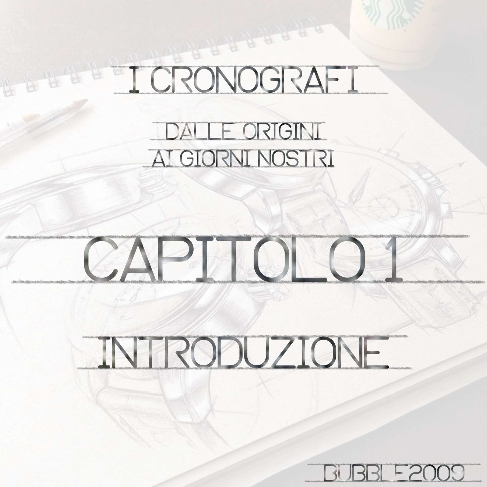
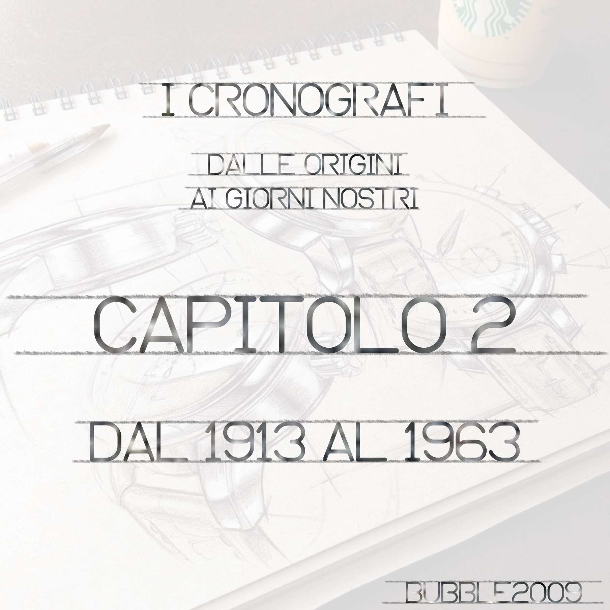
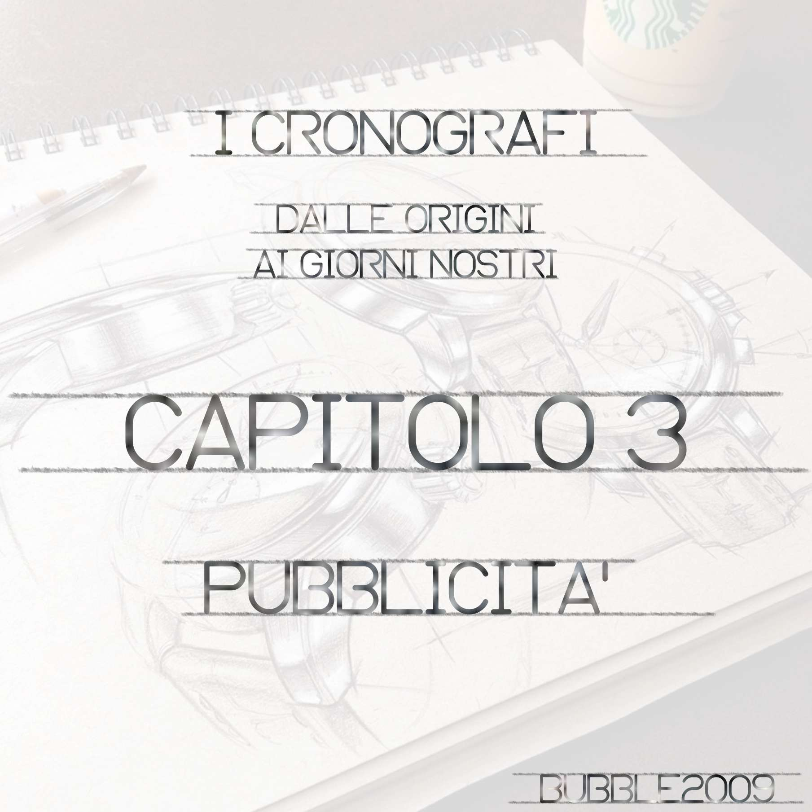
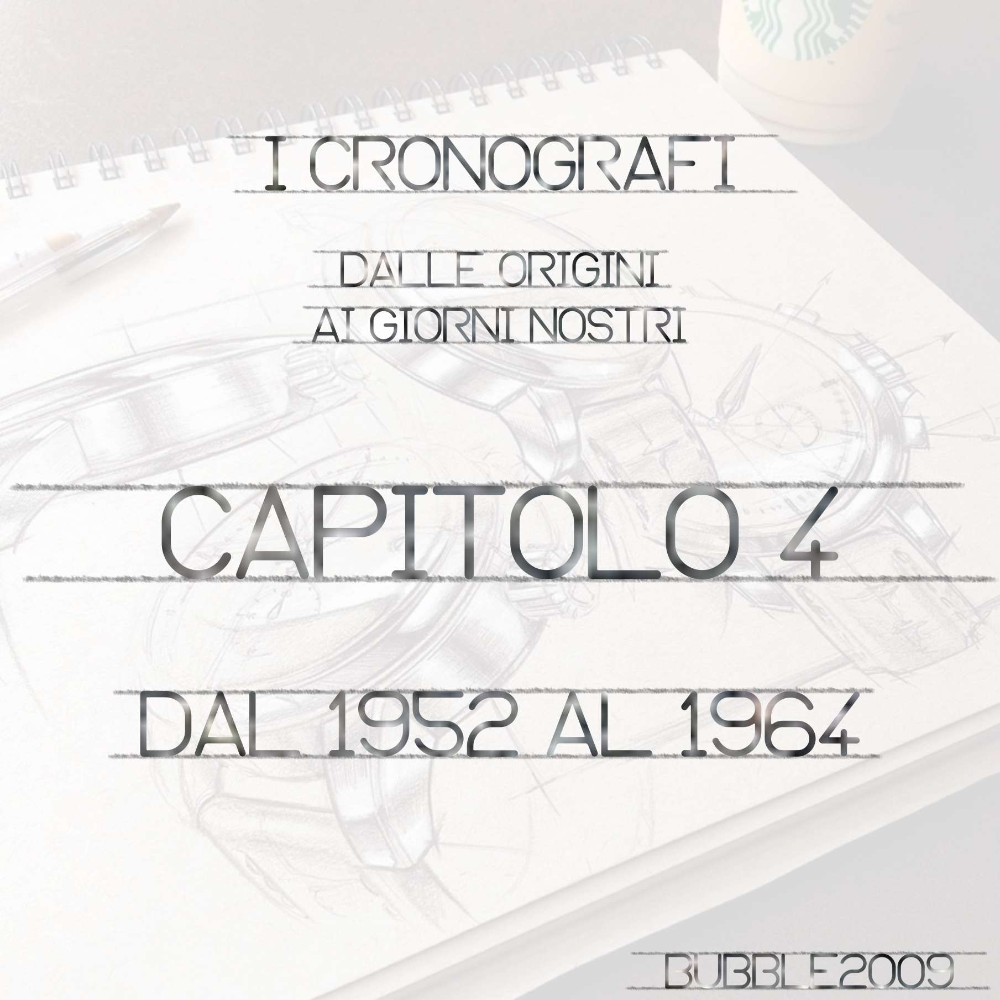
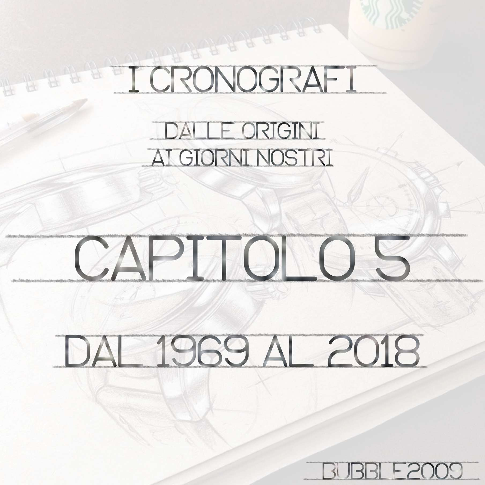
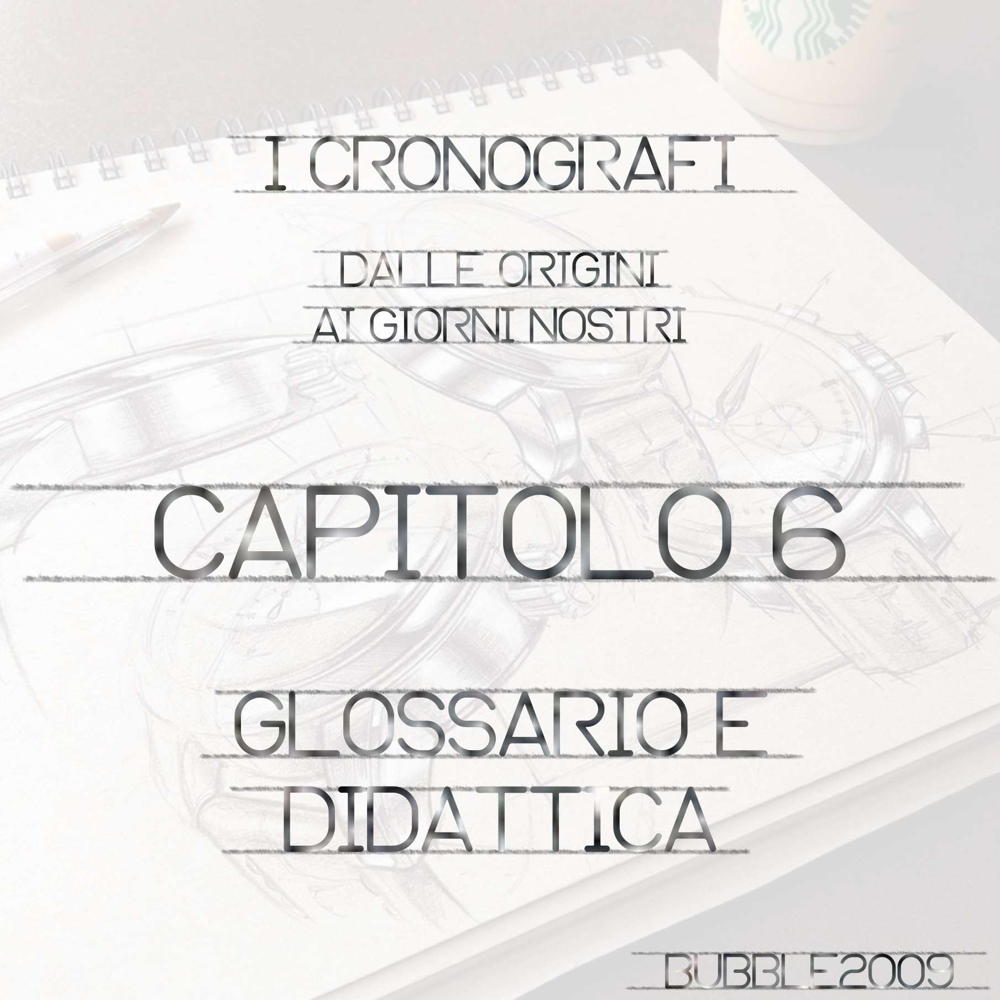
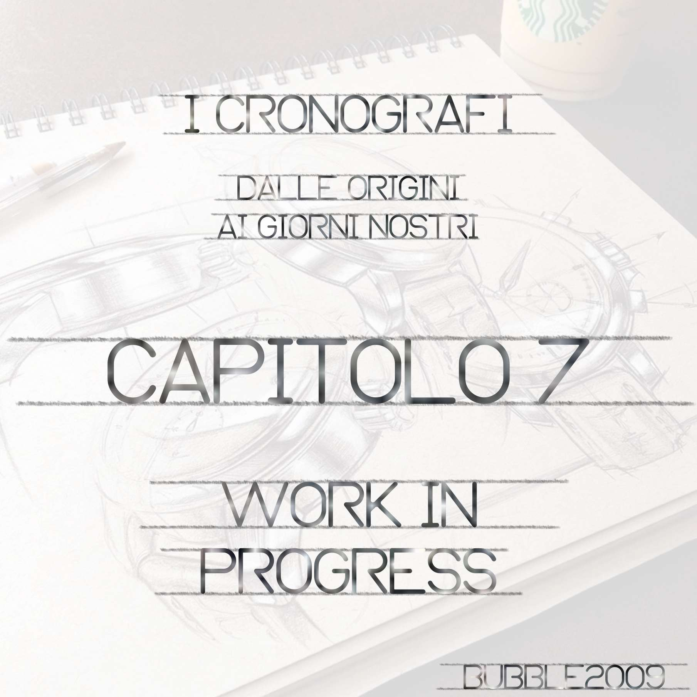
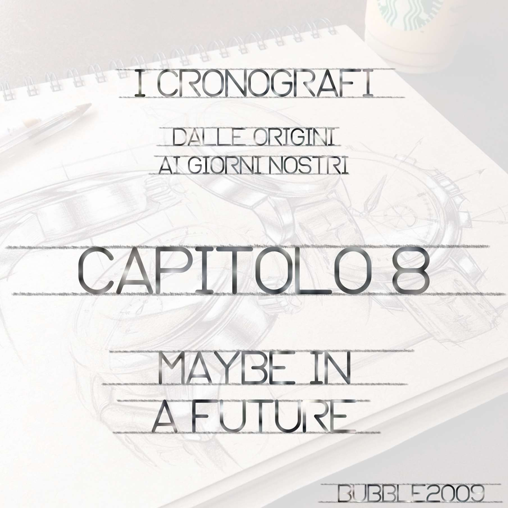

Quanto pubblicherò qui, è frutto di una personale ricerca sulla nascita del cronografo. 
Non posso considerare questa ricerca completata e proseguirò ad aggiungere nuovi elementi qualora dovessi scomparirne di nuovi.

La ricerca è stata molto articolata e vasta, al punto che ho deciso di pubblicarla a capitoli e di scorporare da essa alcune parti che potevano essere considerate autoconclusive.

Di queste parti, sono già state pubblicate le seguenti:

* [Orologi a carica solare](SOLAR/solar_it.md)
* [Orologi al quarzo](QUARTZ/quartz_it.md)

I capitoli della ricerca relativa ai cronografi, sono i seguenti:

|            |            |
| :----------: | :----------: |
|  pubblicato |  pubblicato |
|  pubblicato |  non ancora pubblicato |
|  non ancora pubblicato |  pubblicato |
|  non ancora pubblicato |  non ancora pubblicato |

