# I Cronografi 

I cronografi sono da sempre la categoria di orologi che più mi attrae, così ho pensato di raccontarvi le origini della mia passione.  

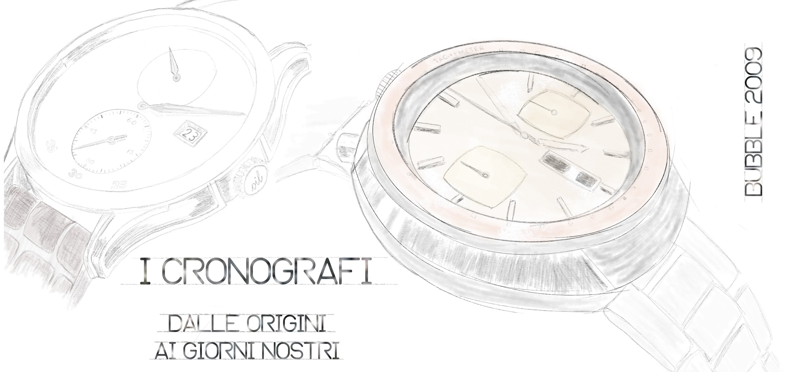
  
In passato, li ho acquistati senza indagare troppo sul perché o sul percome, semplicemente basandomi sull'estetica o su poco altro. 
Il mio primo orologio in grado di *”contare”* i secondi fu uno **Stop Swatch** che ho recentemente ritrovato. Purtroppo solo il quadrante (cinturino spezzato) enon funzionante. 
Da questo primo *“crono”*, la passione è proseguita e si è evoluta fino ai giorni nostri. 
Di seguito una foto trovata in rete del suddetto cronografo svizzero plasticoso.

  
Dopo lo Swatch, se ne sono susseguiti parecchi; alcuni li ho perduti, altri mi sono stati rubati, altri ancora gettati o venduti, solo uno è giunto ai giorni nostri, il **Festina F6575C** un bellissimo coronografo con cassa e cinturino in Titanio ed un calibro con una feature molto particolare di cui parlerò dopo.

Capitò poi che mi venne regalato un cronografo che apparentemente ha un aspetto molto importante ma che nasconde tante piccole cose che mi fanno innervosire ogni volta che lo indosso. Un giorno, magari scriverò anche due parole sul **Maserati Traguardo**.

Dopo questa scottatura, mi sono messo a ragionare, a capire cosa ci fosse di speciale nei cronografi e mi sono messo a cercare in rete tutte le informazioni che potevo. 
Ho scoperto tutto un mondo che si cela dietro a questo genere di segnatempo che non avevo mai considerato ed ho deciso di riportare i miei appunti nero s bianco, per future condivisioni o aggiornamenti.

Ho pensato di inserire anche un glossario finale. Se trovate il simbolo :book: vicino ad un termine, vuol dire che è stato inserito nel glossario.

***
## Cronometri e Cronografi

Inizio con una precisazione su due termini che spesso vengono confusi e/o invertiti:  **Cronometro** e **Cronografo**.
  
Nel linguaggio comune, si indica con il termine **Cronometro**, lo strumento per misurare il tempo; in realtà il termine coretto è **Cronografo**. 
Questo termine **non** indica di per sé un orologio, ma bensì una **complicanza** atta a misurare il tempo trascorso in un determinato lasso di tempo.   
Ci sono molte varianti di cronografi, ma mediamente hanno tutti uno o più contatori dedicati a questa funzione.
  
Il termine **Cronometro**, invece, indica un orologio caratterizzato da una notevole precisione e da una grande regolarità, accertata da prove eseguite in appositi uffici. 
Il primo **Cronometro a pendolo**, fu realizzato nel 1664 da **Christiaan Huygens**, ma fu nel 1735 che **John Harrison** realizzò il suo primo cronometro nautico a bilancere.  
Nel 1762, sempre **Harrison**, realizzò il suo H-4, di appena 13 cm di diametro e del peso di soli 1,45 kg, che dopo ottantuno giorni di mare accumulò solo **quattro secondi di errore** sul tempo universale.  

## Le Origini
  
Dopo questa introduzione, va fatto un brevissimo accenno alle origini del **Cronografo**. 
Torniamo quindi al 1675 quando l’astronomo **Richard Townely** ebbe l’intuizione di fermare la lancetta prima di indicare il secondo successivo. 
Questo meccanismo può essere considerato a tutti gli effetti l’antenato del cronografo e venne chiamato *deadbeat escapement* (altrimenti chiamato *“scappamento a riposo”*).   
Il meccanismo prevedeva di arrestare lo scappamento (e di conseguenza la lancetta) tra un secondo e l’altro, in modo da facilitarne la conta. Nacquero così i primi veri :book:**secondi morti** della storia, la complicazione antesignana del cronografo.  

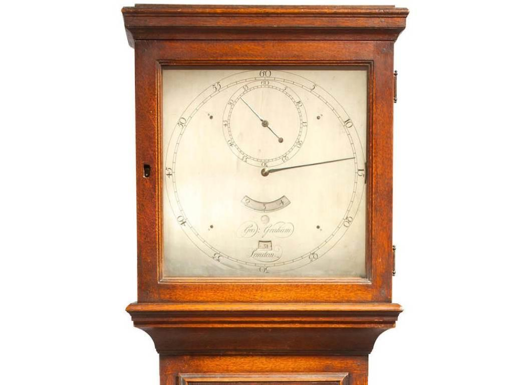
  
La diffusione di questo sistema, però, la si deve a **George Graham** che nel 1720, costruì un meccanismo capace di **dividere il secondo in 4 parti**.   
Il cronografo vero e proprio, però, vedrà la luce solo nel 1816 per mano di **Louis Moinet** che realizzò un dispositivo regolato da uno :book:*scappamento a cilindro* che oscillava alla pazzesca frequenza di 216.000 alternanze/ora. 
Il sistema prevedeva che tutto il meccanismo fosse appoggiato su rubini e completamente **immerso nell’olio** (sarà il primo HydroMod della storia?).  

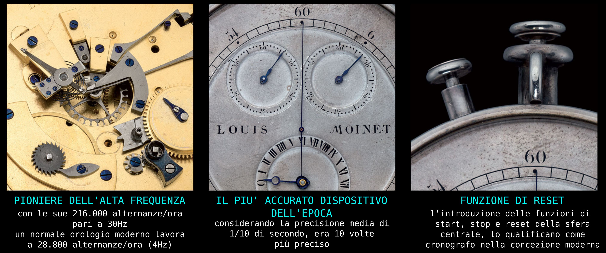
  
|  |  |
| :------- | :--------: |
| Il Cronografo di Moinet fu progettato per conteggiare tempi molto lunghi, ben oltre le 24 ore essendo destinato a usi Astronomici. Quella a lato, è una video rappresentazione  della nascita del cronografo.  La sua lancetta compiva un giro completo al secondo, pertanto, già all’epoca, era in grado di cronografare spaccando il secondo in 60 unità.|  [Guarda il video su YouTube](https://www.youtube.com/watch?v=B5wzuG0Z5aQ) |

Il video inizia mostrando le conoscenze che si avevano prima del 2013. Fino a quell’anno, si attribuiva la creazione del primo cronografo a **Nicolas Mathieu Rieussec** nel 1821.

Nel 2013 vennero poi rilasciate le informazioni sul Cronografo di Moinet che divenne, di fatto, **il primo cronografo della storia**.

L’immagine che segue, ritrae il Cronografo di Nicolas Mathieu Rieussec.  

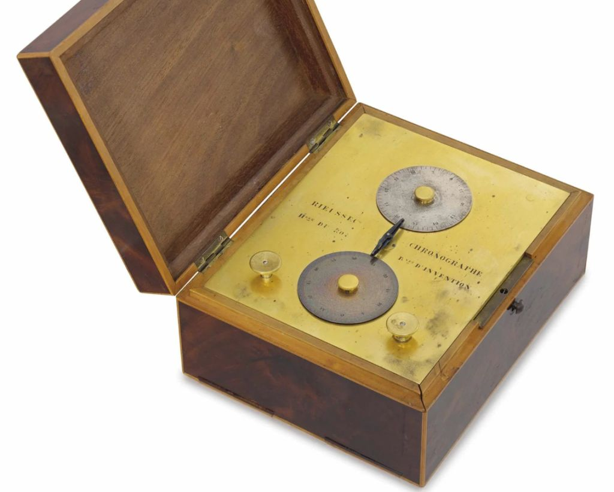
  
La diffusione dei cronografi fu immediata, sempre più *Maison* iniziarono a produrre la loro versione. 
Differenti settori richiedevano diversi tipi di misurazione, nacquero pertanto Cronografi con *indici preposti a soddisfare specifiche necessità*.  

Quelle che seguono, sono le principali *“personalizzazioni”* che venivano (vengono) attuate per effettuare specifiche misurazioni.  

## LE SCALE

Sui cronografi possiamo trovare una o più scale di tipo differente; di seguito proverò a elencare tutte quelle che conosco, cercando di spiegarne il funzionamento:  
  
### La scala **Tachimetrica** 
Si tratta della scala più comune e più conosciuta; serve a misurare una velocità. 
In genere è su base 1000mt pertanto permette di misurare i Km/h, ma è possibile trovare anche altre scale, ad esempio con base 100 mt, per misurare la velocità con altre unità di misura.   
Di seguito possiamo vedere molto chiaramente la scala tachimetrica stampata all’esterno del dial, in questo (situazione rara) la scala arriva fino a 55km/h.  Questa situazione non è particolarmente diffusa in quanto la tendenza è di inserire la straordinaria velocità di 1000 Km/h a circa 3½ secondi, mentre in questo caso troviamo 55 Km/h a circa 5½ secondi ma, per misurare questa velocità, sono necessari 65½ secondi.

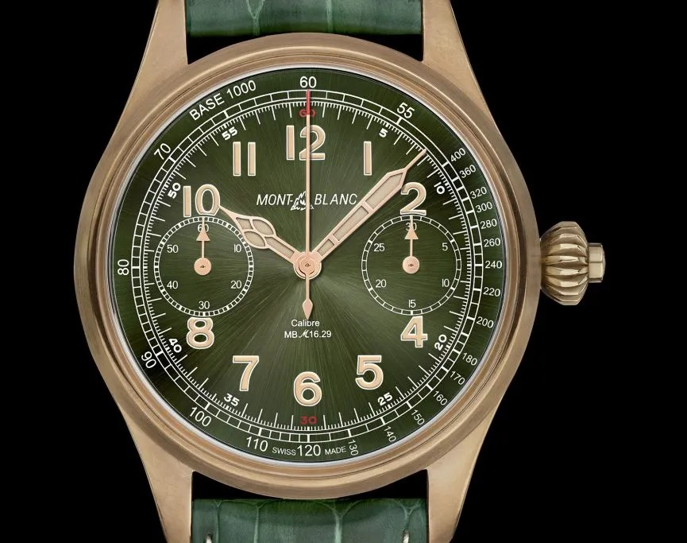 
in foto: `Montblanc ref 1858`

  
Di seguito un esempio di scala tachimetrica in miglia (mph):  

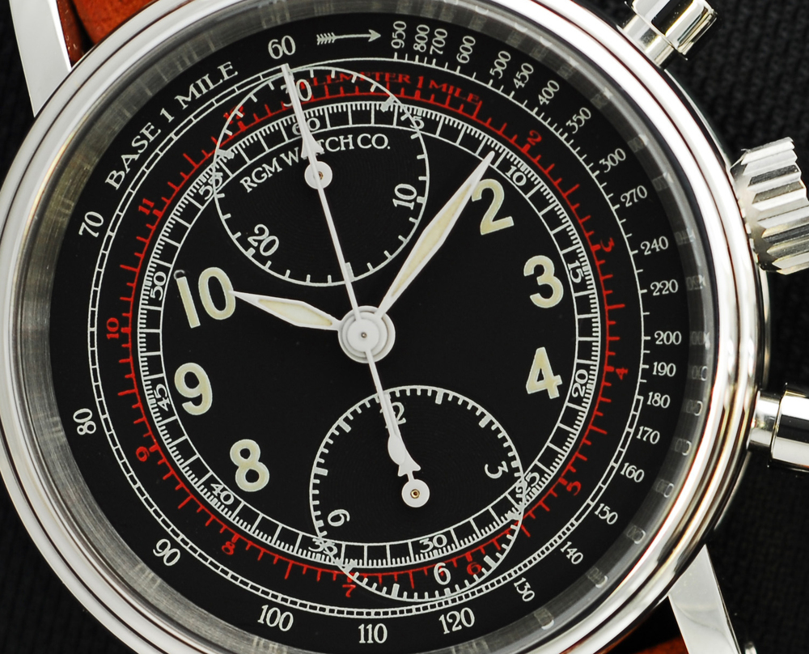 
in foto: `RGM Classic Cronograph ref. 455-B`
  
Il *funzionamento* è molto intuitivo: viaggiando a velocità costante, si fa partire il cronografo al superamento di una pietra miliare e lo si stoppa al superamento della successiva. La velocità media sarà indicato dal numero della scala corrispondente alla sfera cronografica. 
Questo metodo di misurazione implica molte imprecisioni dovute per lo più all’errore umano.  Oggi giorno possiamo misurare la velocità istantanea con un qualsiasi telefono dotato di GPS, ma il fascino di questo tipo di misurazione, rimane invariato.  

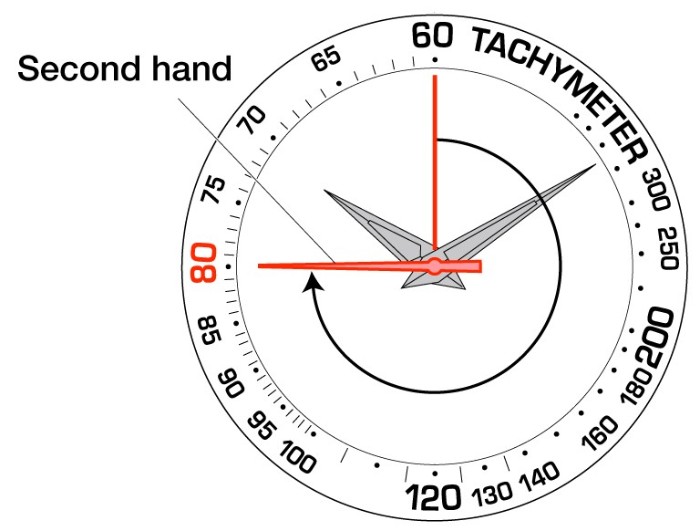
***
### Scala **Telemetrica** anche detta: scala **chiocciola fonotelemetrica** 
Nata in tempo di guerra per conoscere la distanza delle esplosioni, pone i basamenti sulla relazione tra la velocità del suono nell’aria (333,33 m/s) e la velocità della luce (poco meno di 300 milioni m/s).  

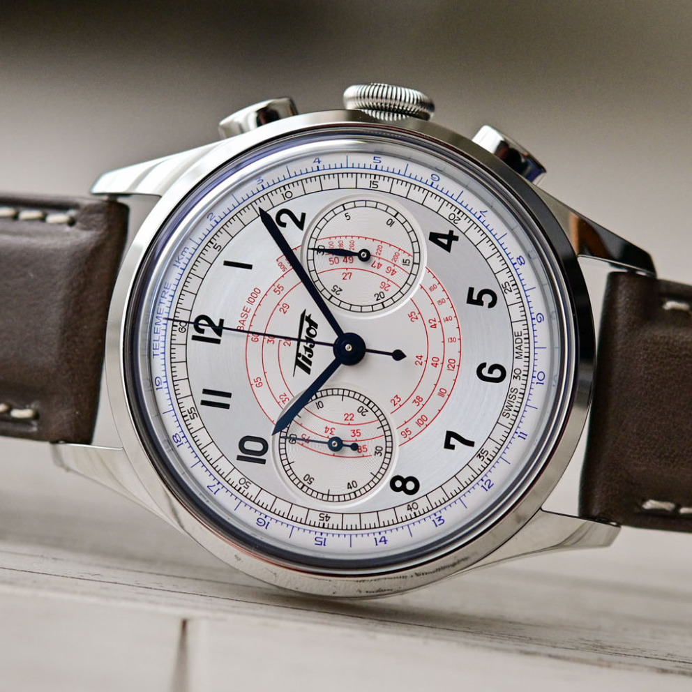 
in foto: `Tissot Telemeter ref T142.462.16.032.00`
  
Di seguito un esempio di scala telemetrica in miglia:  

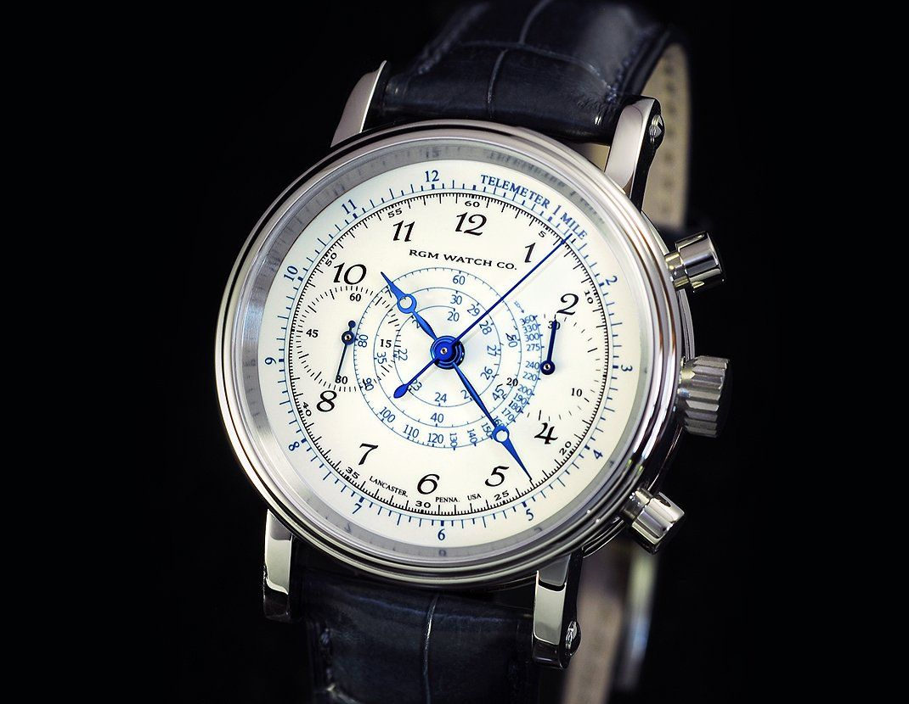 
in foto: `RGM Classic Enamel ref. 455-CE`
  
Il funzionamento è basilare: quando si vede la propagazione luminosa di un evento, si fa partire il cronometro e lo si stoppa quando si avverte il suono. 
Il valore riportato sulla scala telemetrica all’altezza della sfera dei secondi cronografici, indica la distanza del fenomeno. 
Al giorno d’oggi viene utilizzato a scopo “ludico” per misurare la distanza a cui è stato esploso un fuoco d’artificio o a scopo “cautelativo” per conoscere la distanza a cui è caduto un fulmine.  

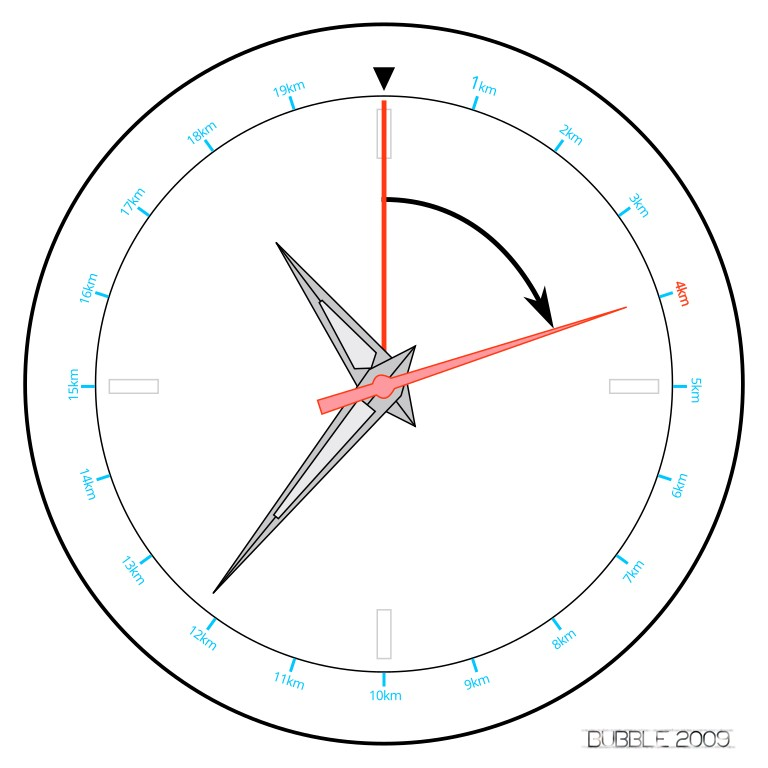 
***
### Scala **Pulsometrica** 
Dispositivo medico che permette di calcolare i battiti agevolmente. Di norma si parte da una base di 30 battiti cardiaci (ma ne esistono anche da 15 battiti).  Dopo aver fatto partire il cronografo, si contano 30 (o 15) battiti cardiaci, dopo di che, si ferma il cronografo e si guarda il numero della scala all’altezza della lancetta dei secondi.   
Nella seguente immagine, potete vedere una scala pulsometrica base 30 in cui 70 bpm corrispondono a 28 secondi  

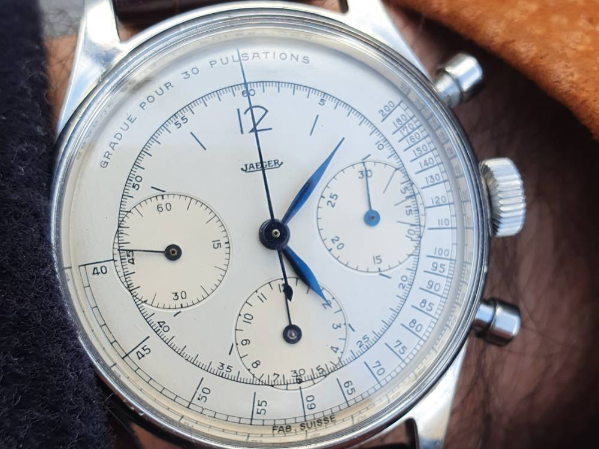 
in foto: `Jaeger-LeCoultre Pulsometer chronograph ref. 224105-1`
  
In quest’altra foto, troviamo la scala pulsometrica su base 15 stampata sulla lunetta. 
Essendo una scala molto più breve, rimane spazio anche per la scala tachimetrica.  

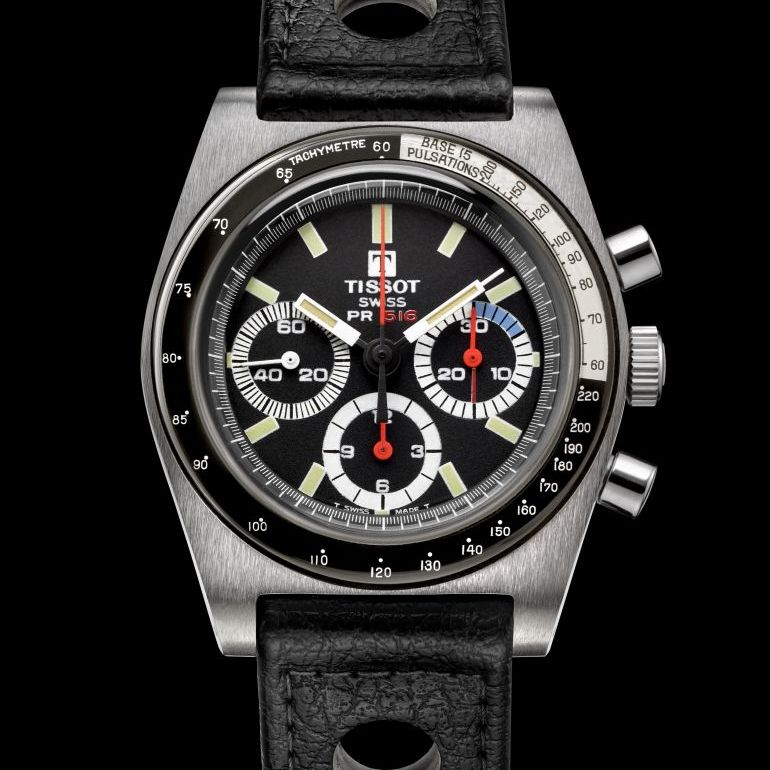 
in foto: `Tissot PR516`
  
L’utilizzo, anche in questo caso, è abbastanza intuitivo.  
Come accennato sopra, si fa partire il cronografo e si contano il numero di battiti richiesto dalla scala (30, 15 o 10). 
Al raggiungimento dei battiti richiesti dalla scala, si stoppa il cronografo e si legge il numero riportato in corrispondenza della sfera dei secondi cronografici. 

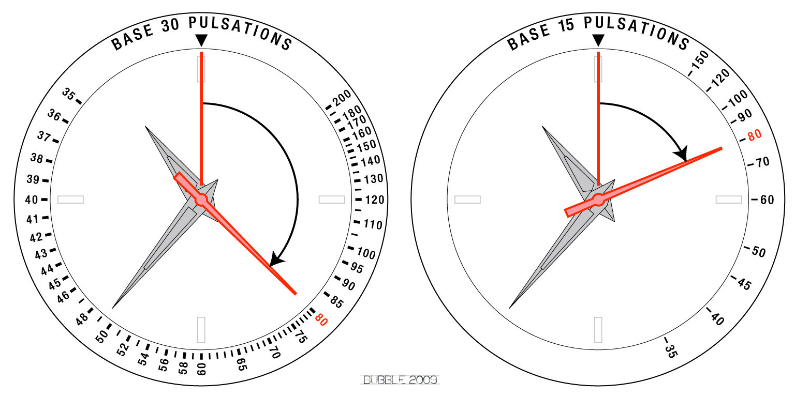
  
Nel grafico non è portata la scala con base 10 pulsazioni in quanto ne ho scoperto l'esistenza di recente, insieme alla scala che segue. 
Troverete la foto di un segnatempo con questa scala quì di seguito insieme ad una scala molto rara.  
***  
### Scala **Asmometrica** 
Sebbene più rara perchè poco precisa, esiste un'altra scala medica, quella asmometrica il cui funzionamento è analogo a quella pulsometrica, ma si occupa di misurare la frequenza respiratoria.   
In genere si trova questa scala abbinata alla scala pulsometrica negli orologi dedicati nello specifico ai medici.  

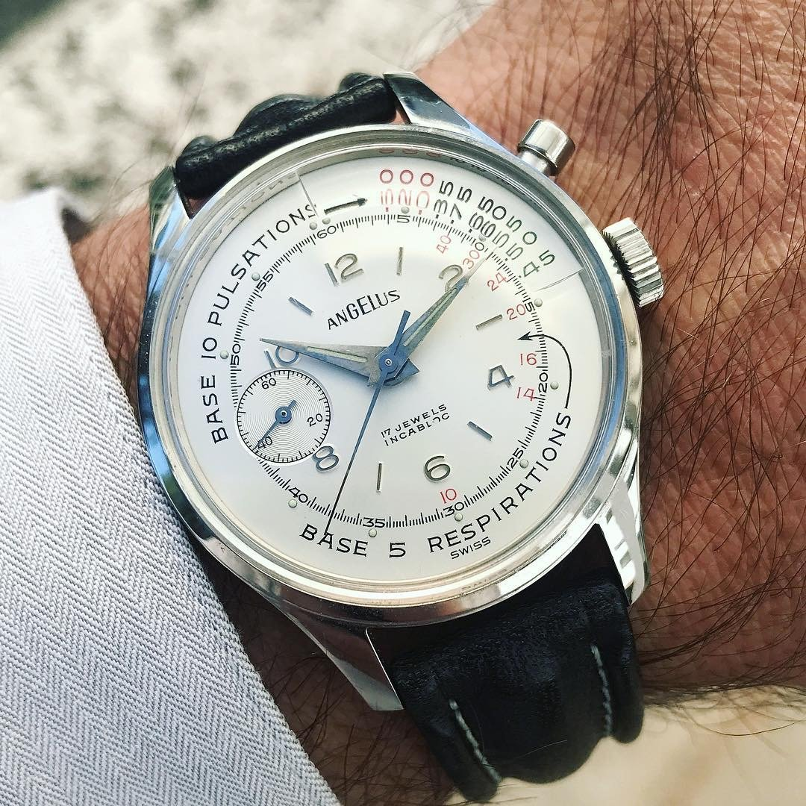   
in foto: `Angelus Chronographe Médical - cal. A5000`

 
in foto: `Longines Asthmometer Pulsometer Chronograph - ref. L2.787.4.16.0-2 - cal. L652.2`
  
Al pari della scala pulsometrica, in questo caso dobbiamo contare il numero di respiri indicato dalla scala, facendo partire il cronografo al primo e stoppandolo al raggiungimento del valore di indice. Il numero di respiri al minuto sarà dato dal numero in corrispondenza della sfera dei secondi.  

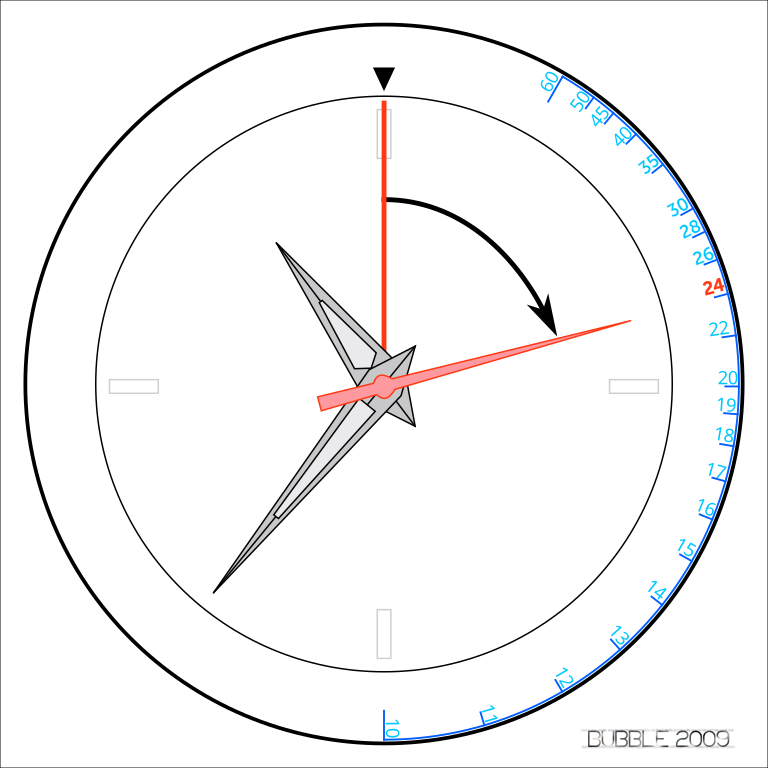
***  
### Scale ***varie ed eventuali*** 
Esistono altre scale, presenti per lo più su orologi del tipo *Pilot*, scale per calcolare i consumi, per calcolare i tempi di percorrenza, effettuare calcoli oppure conversioni.  
Queste scale, però, funzionano in maniera indipendente dal cronografo, pertanto non farò alto che menzionarle nell’elenco qui sopra.

***
  
Con questo inciso sulle scale utilizzate nei cronografi, credo di aver esaurito la prima sezione di questa brevissima ricerca.  
Mi riservo di aggiornarla periodicamente, sperando anche in un vostro aiuto a colmare eventuali lacune o a correggere errori.  

:link: [Torna all'indice della sezione Cronografi](../../README.md)