# CRONOGRAFI DA POLSO

La storia del Cronografo è indubbiamente importante, ma a me interessano principalmente quelli da polso, pertanto ora andrò ad analizzare le più importanti tappe toccate dalla storia dell’orologeria cronografica che ci hanno condotti fino ai giorni nostri:  

## **1913**
### Longines 13.33Z

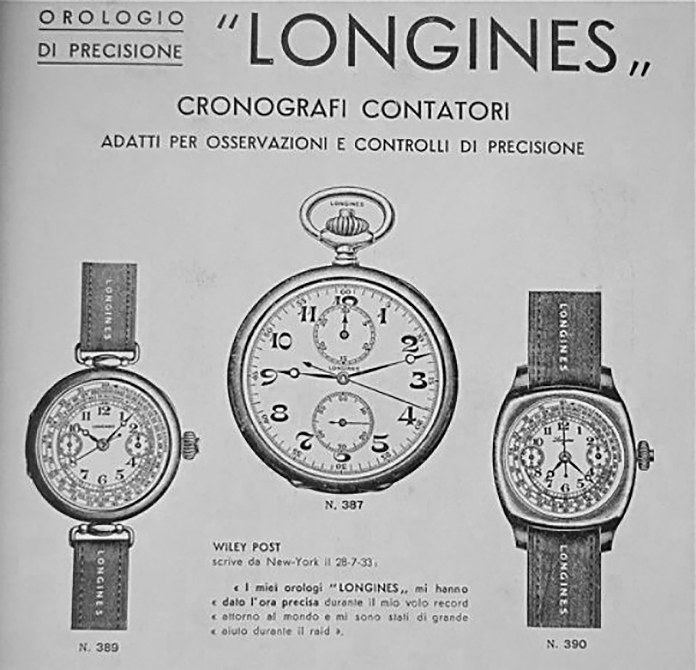

Fino al 1913, esistevano solamente cronografi da tasca, ma, con il passare dei tempi, le esigenze di misurazione del tempo cambiarono. 
Sempre più spesso serviva poter tenere traccia del tempo trascorso mantenendo entrambe le mani libere. Due esempi tra tutti: pilotando un aereo o per cause più letali, imbracciare un fucile. 
**Longines** fu la prima a sodisfare questa esigenza con il calibro **13.33Z**. 
Si tratta di un calibro con ruota a colonne e frizione orizzontale 29 mm di diametro e 6 mm di altezza. 
Questo primo movimento Cronografico era dotato di un **monopulsante** inserito nella corona. 

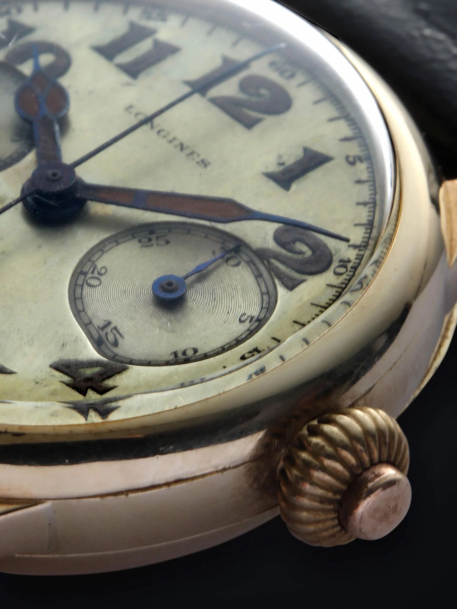

La pressione attivava in successione le tre funzioni cronografiche: Avvio, Arresto, Azzeramento. 
Si tratta di un calibro con 18 rubini ed una frequenza di 18.000 A/h (siamo ben lontani dalle 216.000A/h del primo cronografo). 

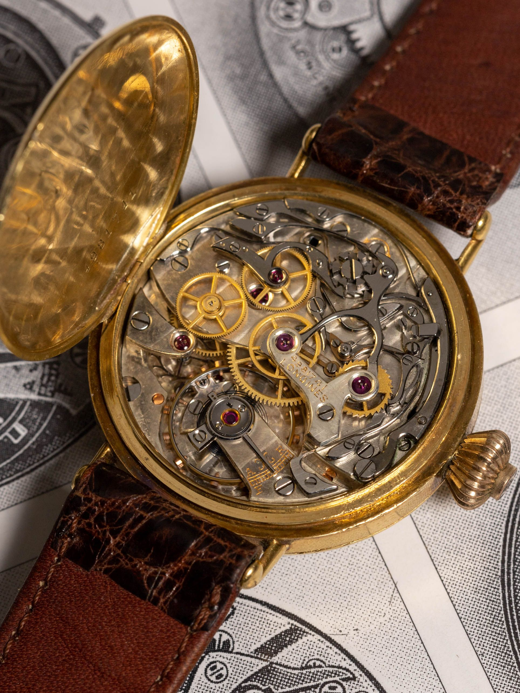

Altre caratteristiche di questo movimento (alcune del tutto uniche): l'attacco della molla saltarello per la ruota del contatore dei minuti localizzata sul ponte del bilanciere. 
La lancetta del cronografo avanzava in avanti con incrementi di 1/5 di secondo. Dopo ogni rotazione, il totalizzatore dei 30 minuti saltava esattamente ed istantaneamente in avanti di una posizione.  

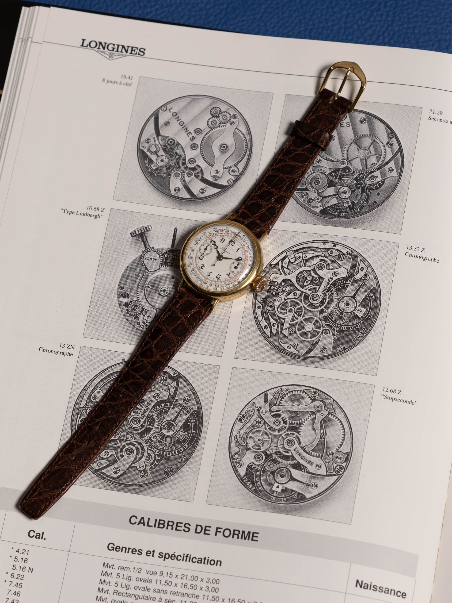
  
Il Longines 13.33Z venne prodotto inizialmente per fini medici, pertanto non è strano trovare impressa sul Dial la scala pulsometrica.  

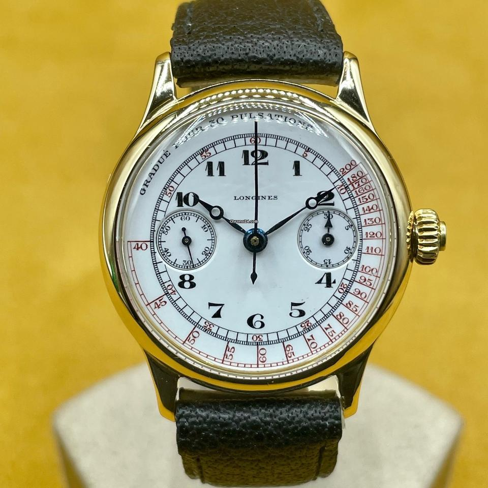

Ben presto vennero realizzati dial con altre scale per rispondere a molteplici esigenze.  

In questo esempio troviamo due scale tachimetriche concentriche:  
* la prima, su base 1000mt, è stampata inizialmente in colore blu per poi declinare nel nero. 
È incredibilmente dettagliata fino a 180 secondi misura velocita comprese tra 30 e 200Km/h;  
* la seconda, di colore rosso, è su base 100 mt. Si tratta di una scala poco diffusa, di cui non ho trovato particolare letteratura in proposito.  

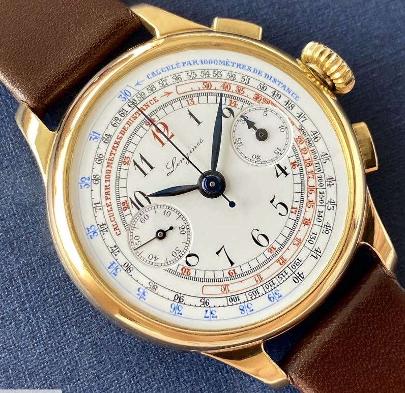
  
Il calibro 13.33Z è rimasto in produzione fino al 1936; durante questo periodo ha subito alcune modifiche che sono poi confluite nel calibro 13ZN che vedremo in seguito.  
I passi fondamentali di questo processo evolutivo sono così riassumibili (in ordine cronologico):  
* 13.33Z **“pin-set”**  
* 13.33Z **“stem-set”**  
* 13.33Z **“fly back”**  

Le versioni **“pin-set”** differiscono dai successivi cronografi per la rimessa oraria: in questi orologi è presente un piccolo pulsante (pin= spillo, in inglese) ad ore 2, la cui pressione svincola la corona dalle funzioni di ricarica e le permette, pur non scattando ma rimanendo fissa nella sua posizione, di effettuare la rimessa oraria; in questi modelli manca il pulsante cronografico le cui funzioni sono svolte dalla stessa corona.  

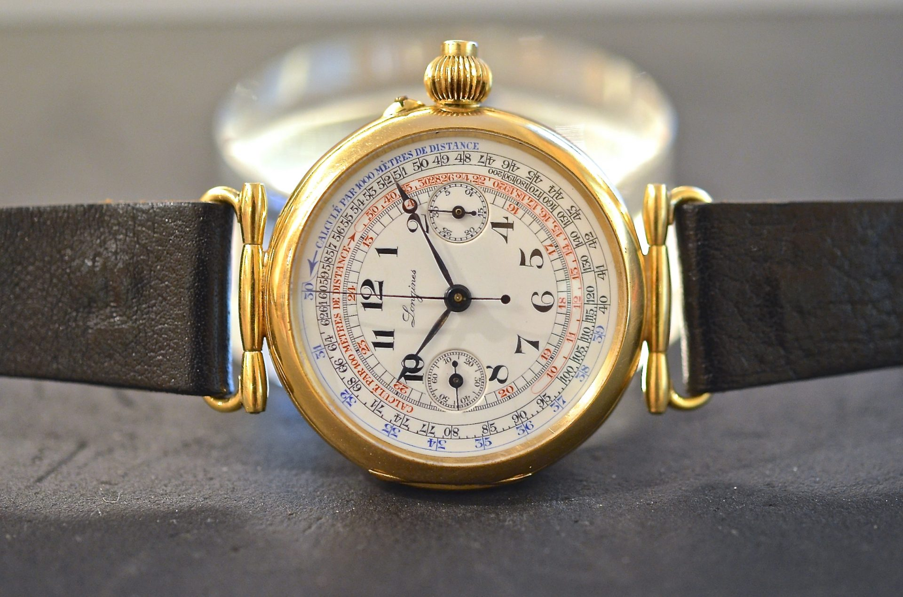
  
Le versioni **“stem-set”** sono le più diffuse, viene inserito il pulsante dedicato alle funzioni del cronografo coassiale alla corona.  

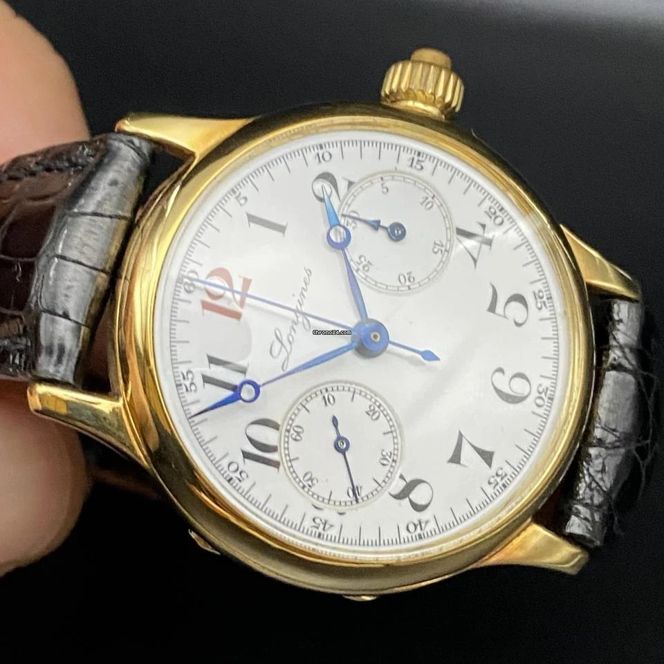

In rete girano anche rare foto di Longines 13.33Z con un pulsante separato ad ore 2, ma, anche in questo caso, la letteratura è lacunosa, riporto una foto recuperata in rete di un Longines del ’33, ma prego non fare affidamento su di essa.  

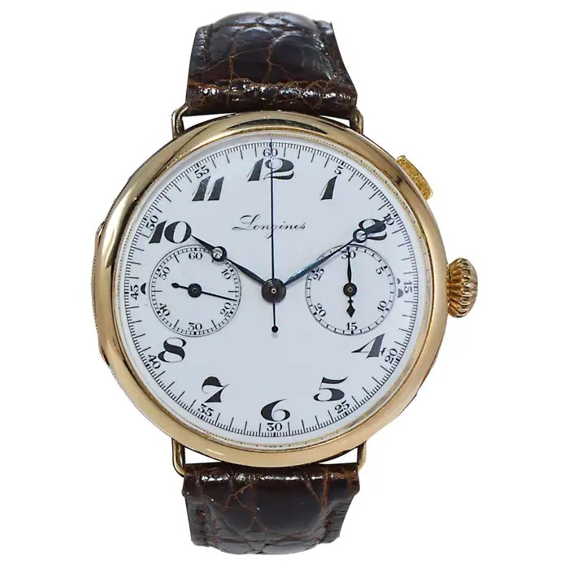

Esistono rarissimi esemplari di calibri 13.33Z in versione **“fly back”** ma essendo più che altro prototipi per il successore di cui parleremo in seguito, c’è pochissima documentazione in merito.   
DI questa versione non ho ancora trovato una foto.

## **1915**  
## Breitling ed il pulsante *indipendente*

Nel 1915 **Gaston Breitling** creò uno dei primi cronografi da polso con pulsante indipendente a ore 2. 
Separava il pulsante del cronografo (che controllava le tre funzioni del cronografo: "start", "stop" e "reset-to-zero") dalla corona. 
Questo colpo di genio, non solo ha reso il cronografo più facile da usare, ma ha anche contribuito a prevenire gli errori rendendo la funzione di avvio un'azione molto deliberata, separata da qualsiasi azione sulla corona di carica. 
Sul sito Breitling specificano *“uno dei primi”*, ma in rete viene indicato come **il primo**. Si tratterebbe, quindi, del precursore dello shape dei cronografi moderni. 

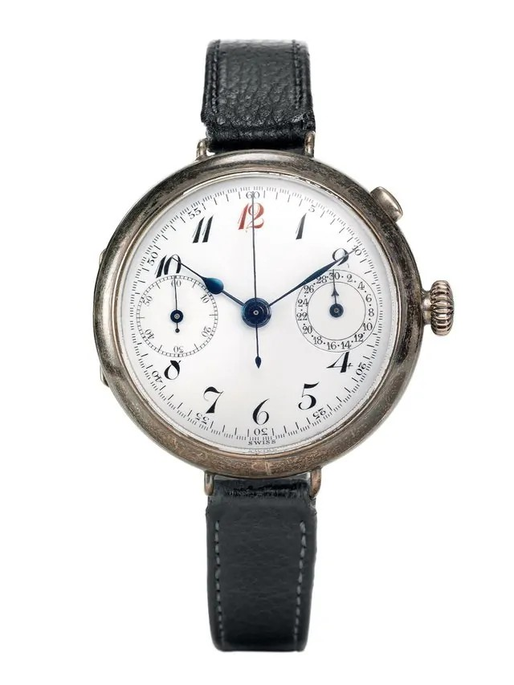

Questo cronografo venne adottato dalla RAF. 
Purtroppo, anche di questo primo cronografo di casa Breitling, si trova pochissima documentazione, al momento non ho trovato informazioni in merito a calibro e referenza. 

## **1917**  
### Universal Genève
  
Solo una piccola parentesi, nel 1917, anche Universal Genève ha iniziato a produrre cronografi. 
Come lei, molte altre Maison hanno seguito la tendenza creando i loro cronografi prendendo spunto da quelli esistenti. 

## **1922**  
### Patek Philippe ed il cronografo *rattrapante*
  
La complicazione del cronografo :book:*rattrapante* è stata brevettata da Patek Philippe nel 1902, ma vide l’applicazione in un cronografo da polso, solo nel 1922.  
Anche di questo primo crono “split second” non si trova documentazione. 
Mi riservo di aggiungere in un futuro prossimo, ulteriori nozioni in merito visto che è un passo importante per la storia dei cronografi.  

## **1934**
### Breitling n°100, *il doppio pulsante*
  
Nel 1932 **Willy Breitling** sostituisce **Gaston Breitling** a capo della Maison. 
Solo l’anno seguente, viene presentato il brevetto per il **cronografo da polso dotato di due pulsanti**.  

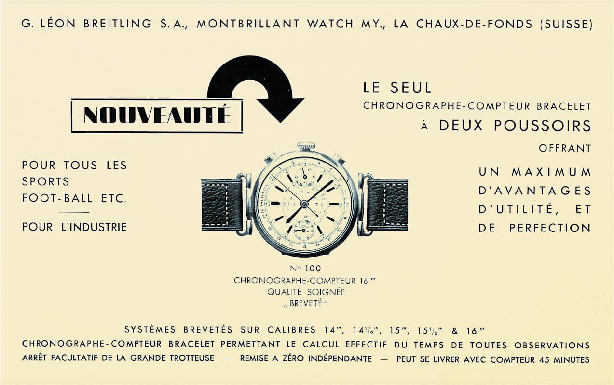
  
Con questo orologio, Breitling, stabilisce di fatto il design che da allora viene (quasi) universalmente utilizzato per i cronografi.  

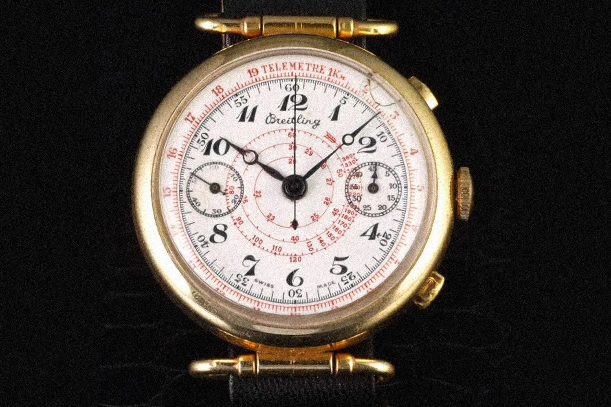  
  
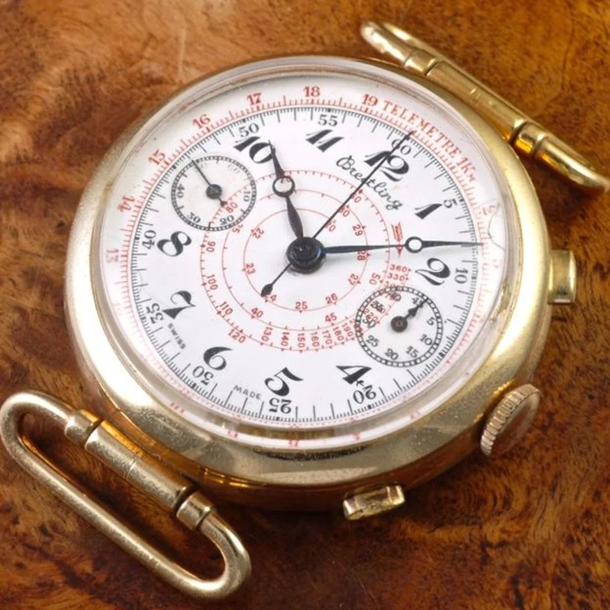

  
Ed ecco una visuale laterale del doppio pulsante.  

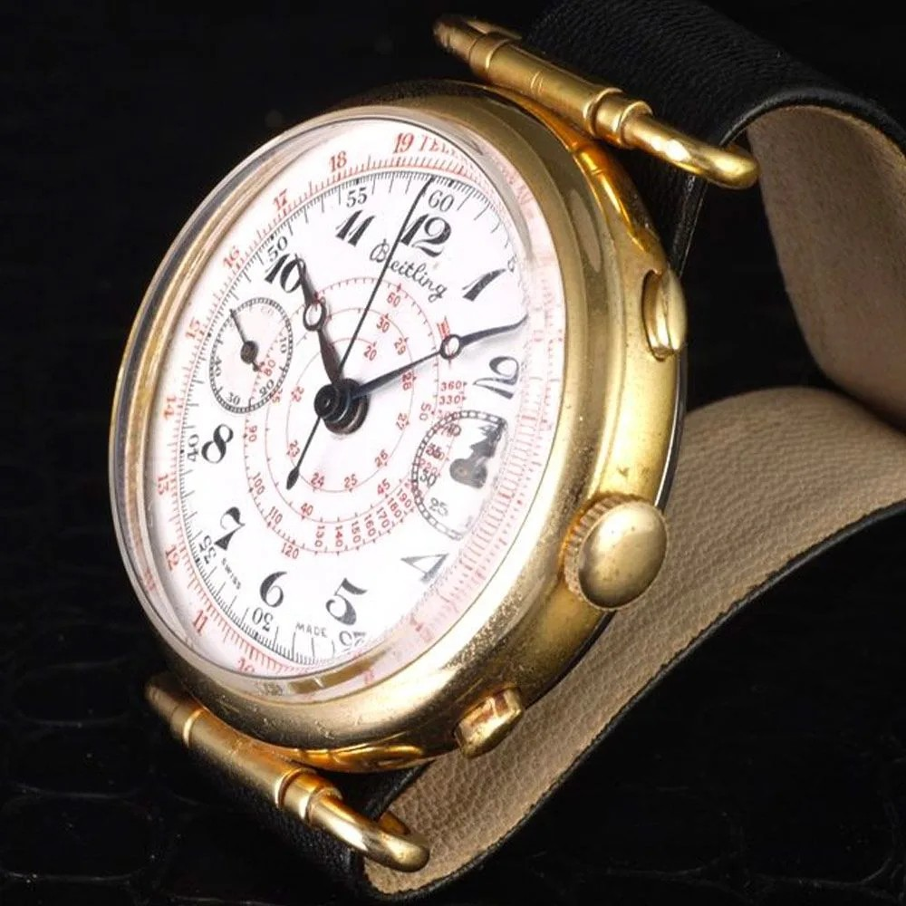

## **1936**
### Longines 13ZN *Fly-Back*
  
Arriviamo quindi al 1936, anno in cui Longines presenta il calibro 13ZN, diretto successore del 13.33Z.  

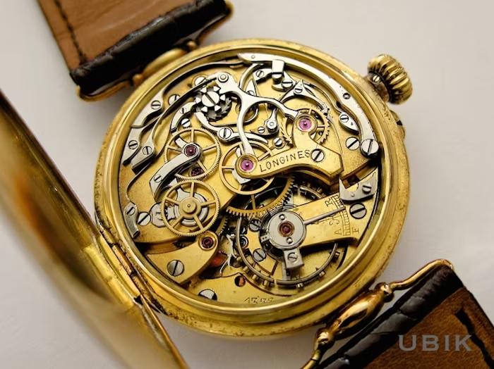
  
Questo movimento presenta una tradizionale disposizione cosiddetta *“Lepine”*, che prevede 6 ponti.  

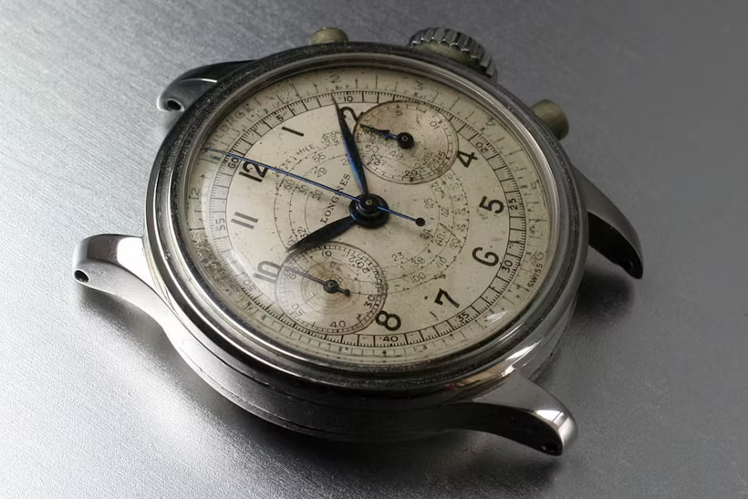

  Lo smistamento della cronografica avviene tramite ruota a colonne. È dotato inoltre della funzione Flyback:book: per la quale è stato richiesto il brevetto, rilasciato nel 1935.  

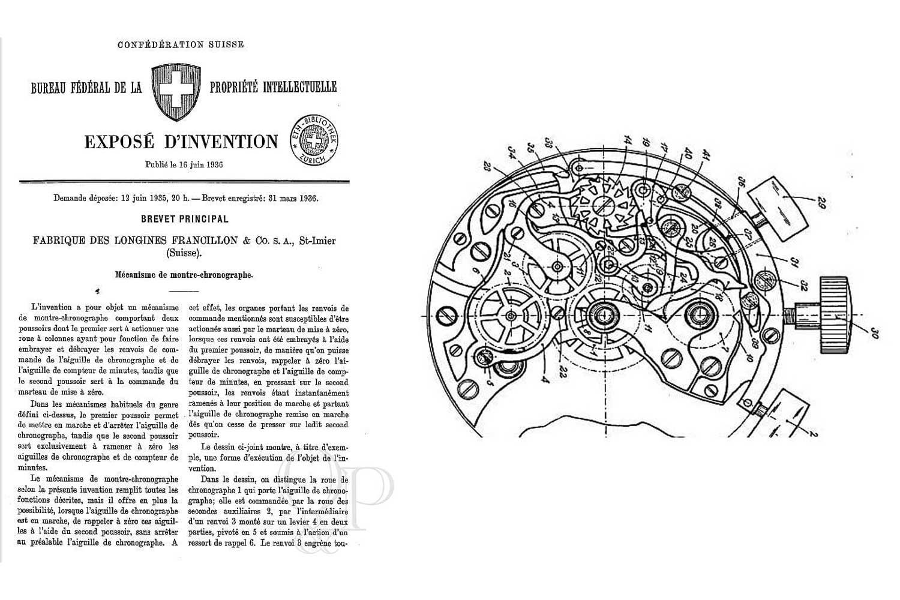

Il bilanciere è monometallico con viti di compensazione con spirale Breguet e oscilla ad una frequenza di 18.000 a/h. 
Ecco uno spaccato di questo calibro:  

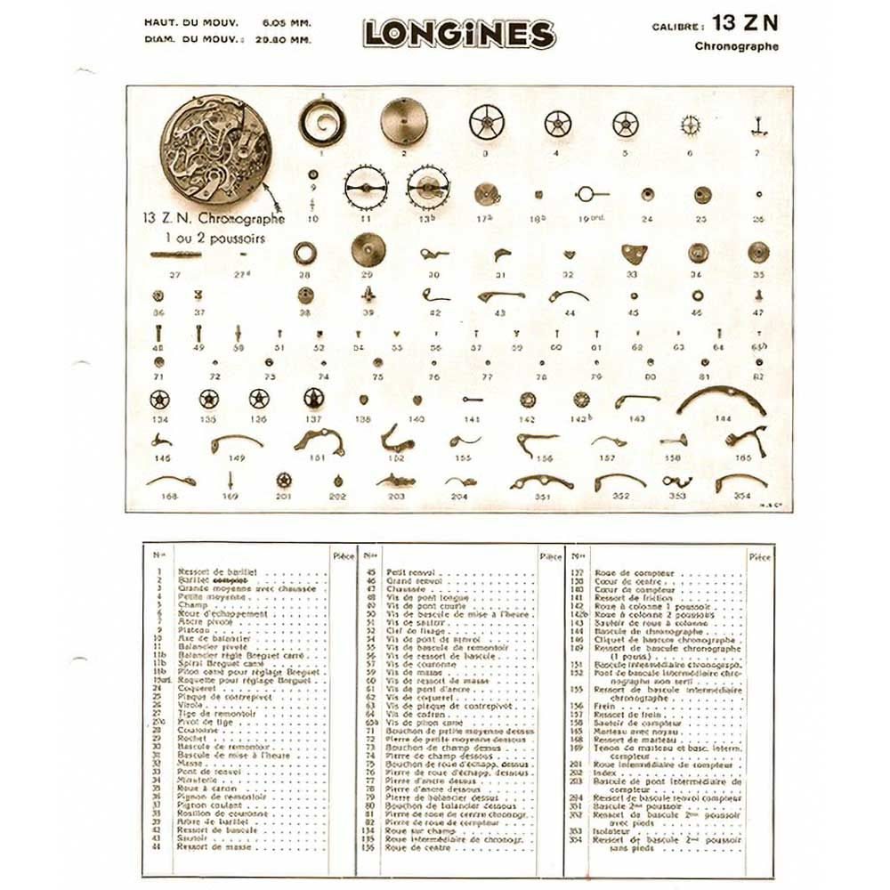
  
Ed alcune pubblicità di segnatempo animati da questo calibro:  

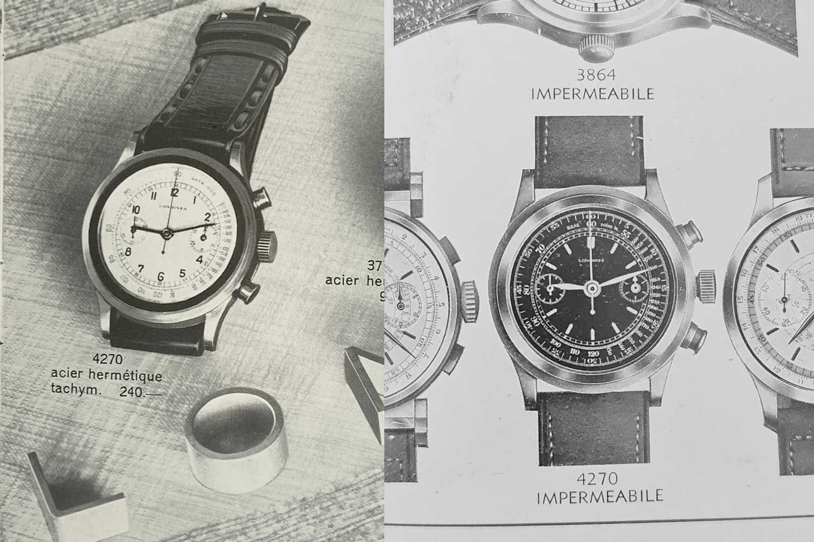

***
  
Con il Longines **13ZN** si conclude questa seconda parte.
La ricerca tornerò dopo una piccola pausa pubblicitaria.  

:link: [Torna all'indice della sezione Cronografi](../../README.md)

