# Pubblicità

In questo periodo storico, Longines ha occupato una posizione veramente importante nello sviluppo dei Cronografi da polso, per questo motivo ho deciso di dedicare uno spazio a pubblicità e a foto di cataloghi degli inizi del 1900.

### Seven reasons for Longines Supremacy

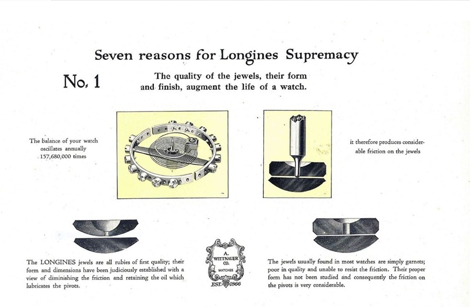  
  
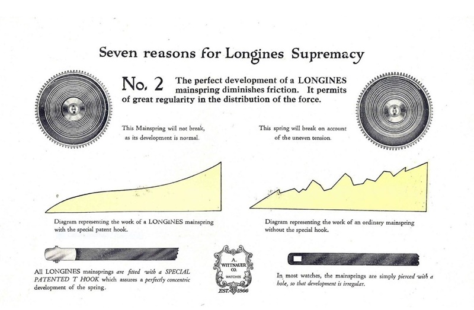  
  
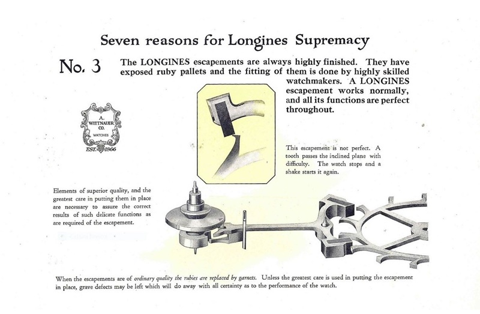  
  
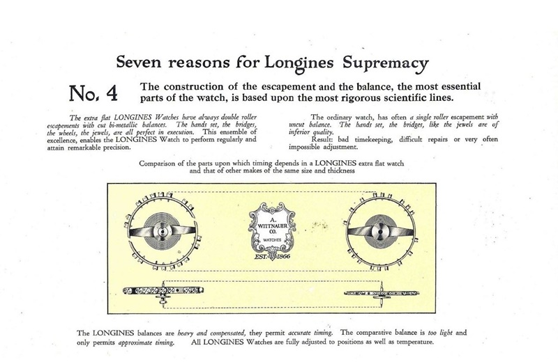  
  
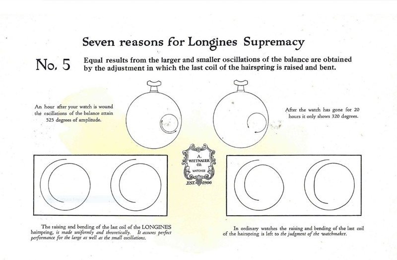  
  
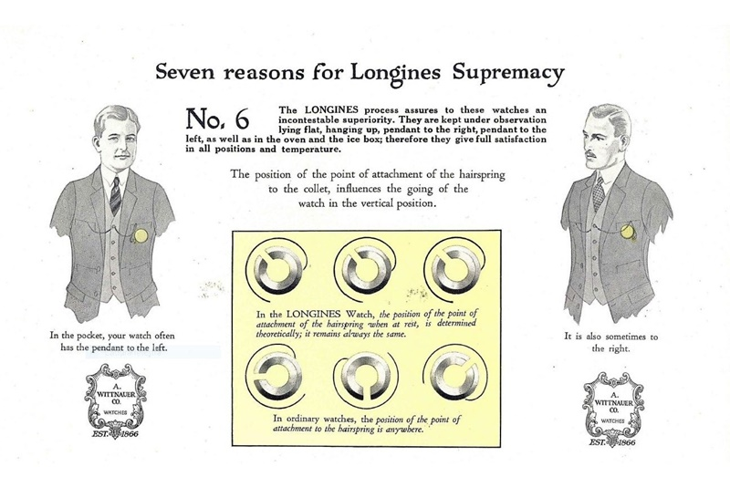  
  
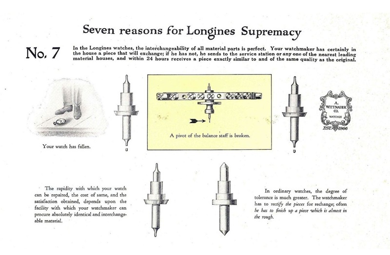  

***
  
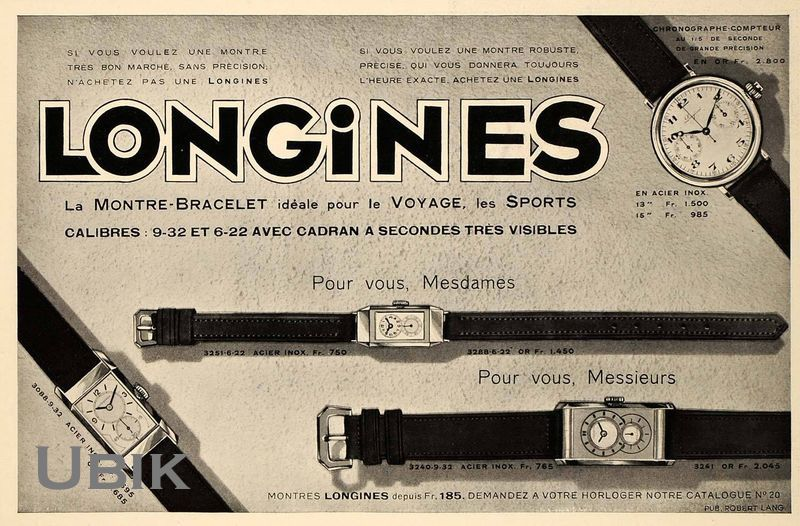  
  
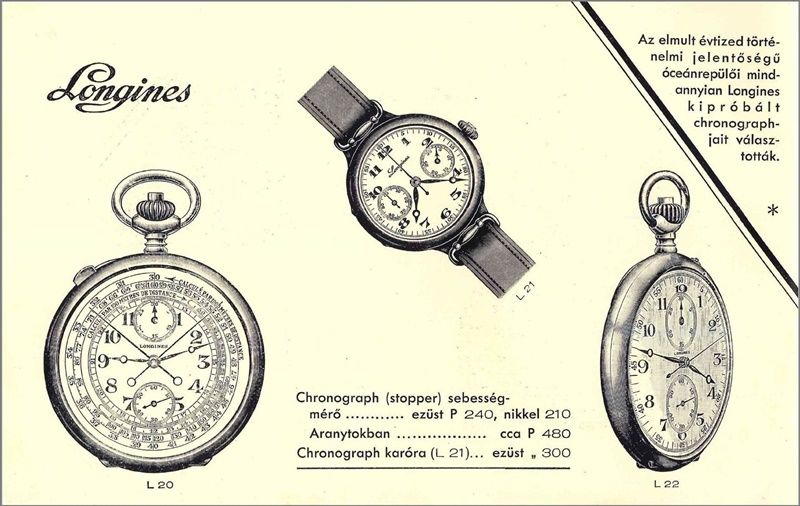  
  
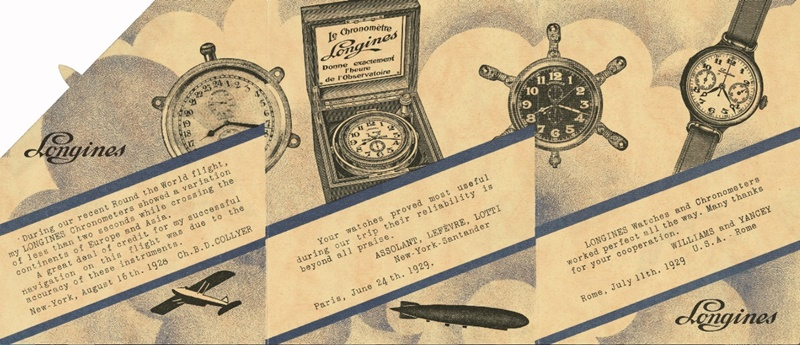  
  
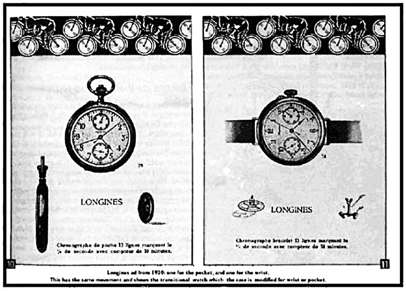  
***  
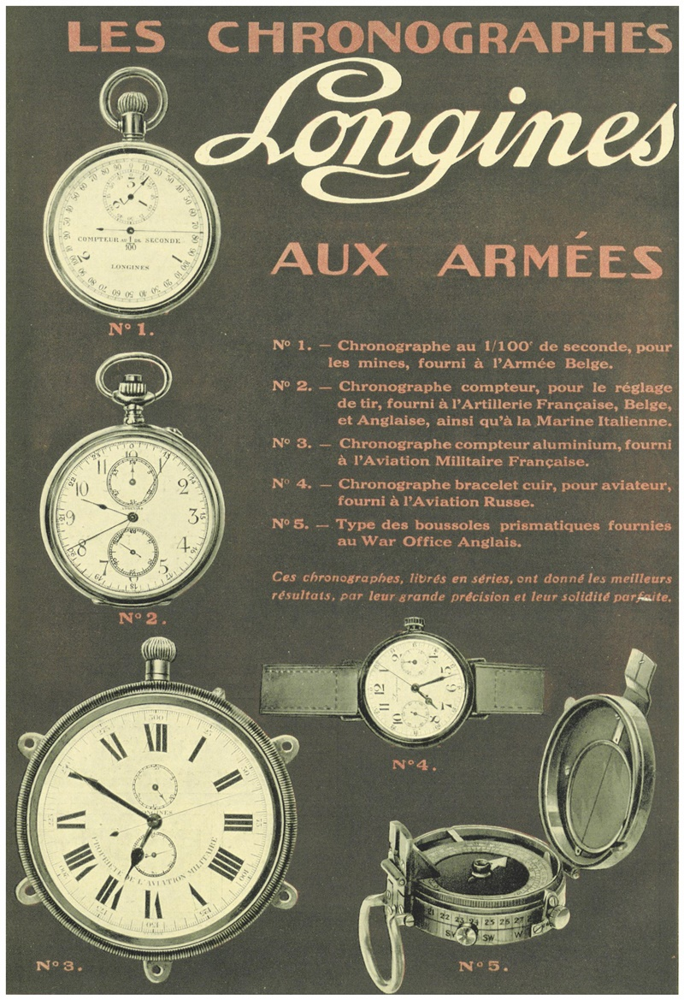  
  
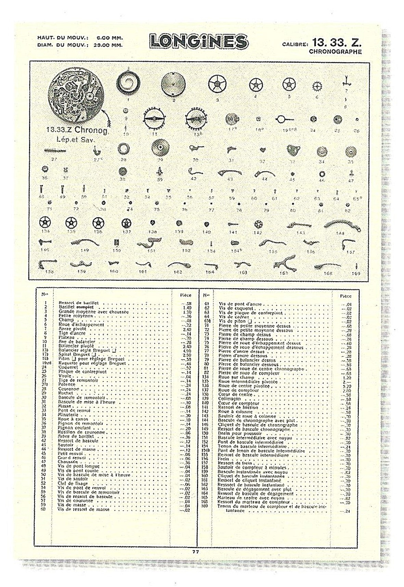  
  
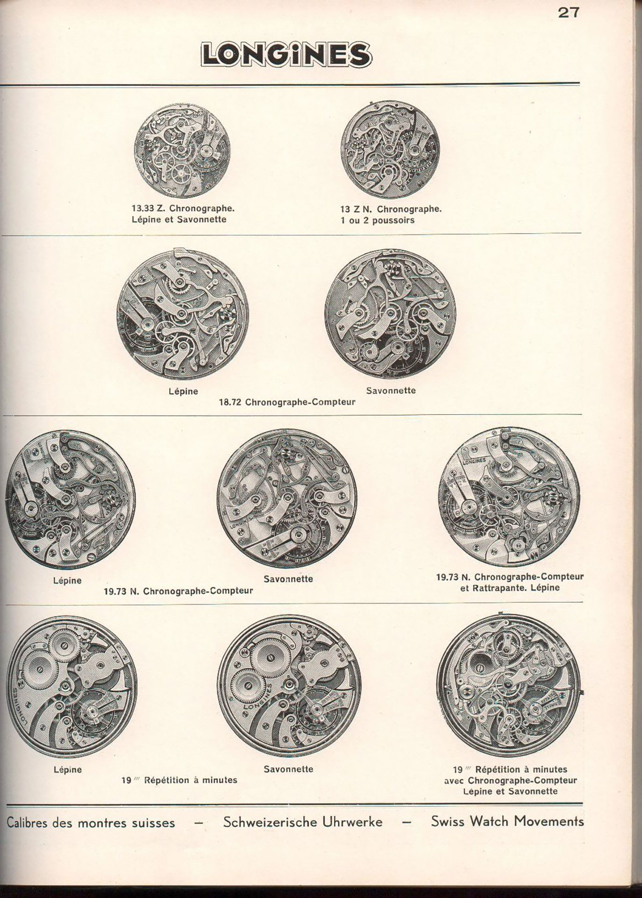

***
  
Terminato lo spazio pubblicitario, arriverà la 4a parte della ricerca.

:link: [Torna all'indice della sezione Cronografi](../../README.md)
