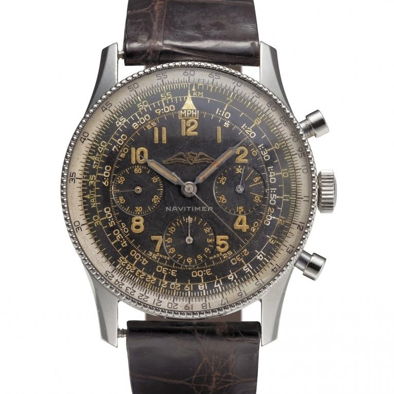
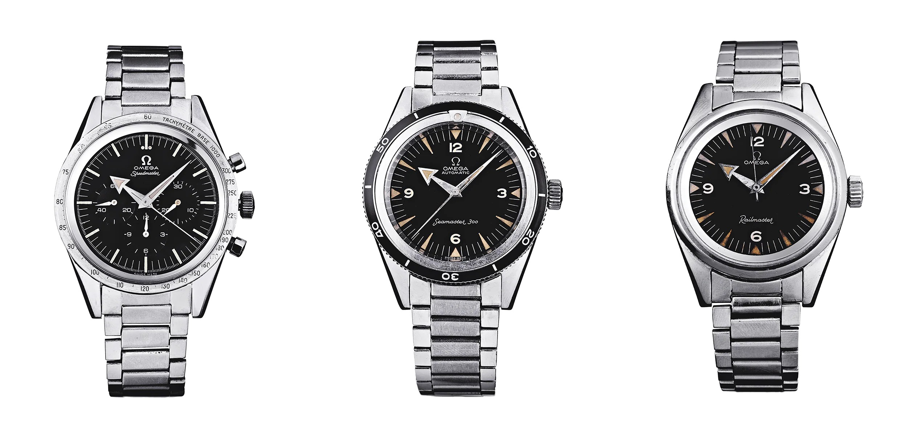

# La diffusione dei coronografi

I cronografi da polso sono oramai entrati nel quotidiano. 
Tutte le Maison, presto o tardi, iniziano a produrre Cronografi dalle linee sempre più moderne. 
Stiamo parlando di Cronografi da polso a carica manuale. 
Vediamo ora la nascita di alcuni iconici modelli.

## **1952** Breitling Navitimer
Breitling presenta il Navitimer un modello diventato iconico.

 
`Breitling Navitimer 1954 - no ref - cal. VALJOUX 72`

Come potete vedere, al di la dell'aspetto vintage del cronografo in foto, oramai lo shape è ancora attuale.

## **1957** Omega Speedmaster
La nascita dello **Speedmaster**, e non solo. 
In quell'anno, Omega, lanciò tre segnatempo iconici, una terna denominata *Professional*, uno più spettacolare dell'altro: 
* Lo **Speedmaster**, destinato ad un futuro pioneristico nell'esplorazione spaziale a fianco della NASA, che gli valse il soprannome di "*moonwatch*";
* Il **Seamaster 300**,  destinato ad esplorare i fondali marini *(io lo adoro)*
* Il **Railmaster** fu il primo orologio in grado di resistere a campi magnetici fino a 1.000 gauss.

Per approfondimenti sul *moonwatch* vi invito a consultare la [ricerca raggiungibile tramite questo :link:](https://watch.forumfree.it/?t=75415170#entry618783776) e per approfondire i test fatti dalla NASA su questo cronografo, vi invito a consultare [quest’altra ricerca raggiungibile tramite questo :link:](https://watch.forumfree.it/?t=74030275#entry608588034)

## **1958** Heuer Autavia *rotating bezel*
Nel 1933 Heuer combinò le parole **AUT**omobile e **AVIA**tion per creare la linea Autavia, ma fu nel 1958 che Heuer introdusse su questo segnatempo la **Lunetta Rotante**. Tutti noi sappiamo le innumerevoli applicazioni di questa semplice, ma innovativa novità.

Da notare la versione :book:**bicompax**  (destra)di questo Autavia. 
Heuer introdusse i dial con due subdial oltre alla seconderia fin dal 1940.

Per approfondimenti sulla storia di questa maison, vi invito a consultare la [ricerca raggiungibile tramite questo :link:](https://watch.forumfree.it/?t=77044032#entry635146966)

## **1963** Heuer Carrera
Heuer avvia la produzione del modello **Carrera **che diverrà ben presto iconico.

`Heuer Carrera ref. 2447S - cal. Valjoux 72`

## **1963** Rolex Cosmograph Daytona
Per quanto non sia fanatico di questa Maison, aveva comunque il diritto di una menzione.

`Cosmograph Daytona - ref. 6239 - cal. 722`

Per approfondire la storia di questa casa, potete consultare la [ricerca raggiungibile tramite questo :link:](https://watch.forumfree.it/?t=74934985#entry613947352)

## **1964** Seiko Crown Chronograph
Dobbiamo attendere fino al 1964 per per vedere il primo Cronografo di produzione giapponese.
Seiko è la prima azienda giapponese a produrne uno nell'anno dei Giochi Olimpici a Tokio.

`Seiko Crown Chronograph - ref. 5719A-45899`

***
  
Ora che anche il Giappone ha lanciato in commercio il suo Cronografo da polso a carica manuale, nella prossima parte vedremo come i cronografi hanno incontrato i calibri automatici.

:link:[Torna all'indice della sezione Cronografi](../../README.md)
