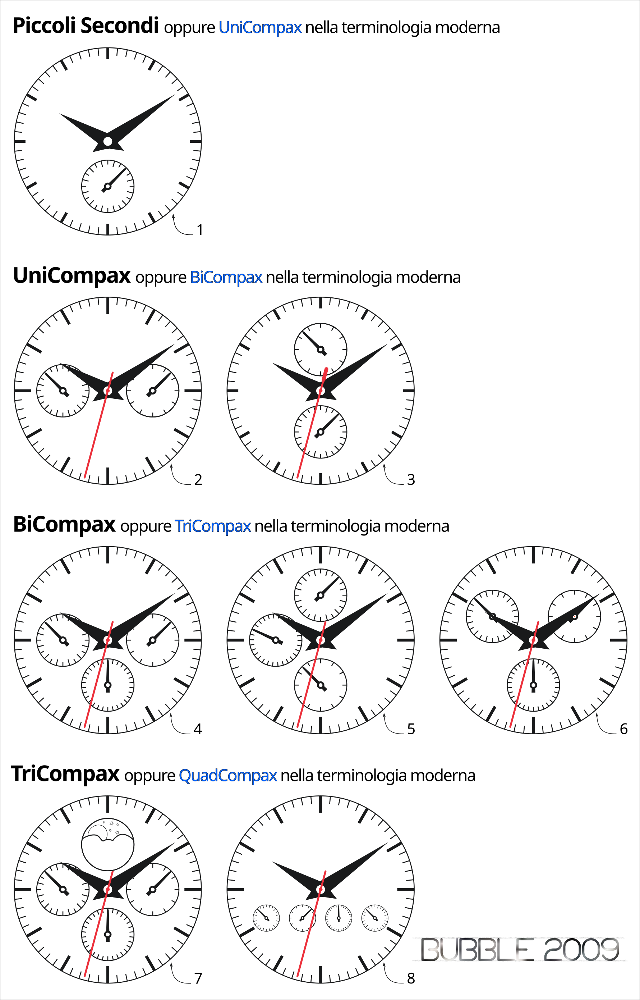

 
# Glossario

Come promesso, inserisco un po' di didattica sui alcuni dei termini utilizzati nella ricerca.

Ecco l'indice dei macro argomenti:
* [Tipi di cronografo](#tipi-di-cronografo)
* [Il Glossario](#il-glossario-vero-e-proprio)
* [Nomenclatura Dial](#nomenclaura-dial)

***
***
## Tipi di cronografo
  
### **Cronografo Centrale**  
Introdotto da Singer Reimagined nel 2017 ed incentrato su un’alta leggibilità della funzione cronografica. È il frutto di un imponente lavoro da parte del team per creare un movimento che permetta di leggere l’ora in modo periferico (ai lati del quadrante) con due dischi rotanti, e le informazioni del cronografo al centro del movimento.  
  
### **Fly-Back**  
Fu Longines, nel 1936, a depositare il brevetto dell’antenato degli odierni cronografi flyback. Questa “complicazione nella complicazione” consente di effettuare misurazioni in rapida successione senza dover azzerare manualmente il cronografo. Viene solitamente utilizzato il pulsante di reset che, quando il cronografo è attivo, fa ripartire istantaneamente la misurazione da zero.  
Per il reset, invece, è necessario prima stoppare il cronografo e poi premere il tasto di reset.  
  
### **Minuti Centrali**  
Le sfere dei secondi e dei minuti cronografici, sono montate sul medesimo albero delle sfere dei minuti e delle ore continue.  
Questo sistema fu introdotto nel 1970 da Lemania con il calibro 1340 e ripresa da Omega con il calibro 1040.  
Sistema che permette una chiara lettura del cronografo, che però fu abbandonato in quanto costoso nonostante i tentativi che si fecero per renderlo più abbordabile e riparabile.  
  
### **MonoRattrappante**  
Vedi :link:[Rattrappante](#rattrappante-aka-slit-second)
  
### **Rattrappante (aka Slit-Second)**  
il primo misuratore rattrapante venne creato nel 1827 da Louis-Fredric Perrelet. Questo particolare tipo di cronografo è utilissimo per registrare due eventi con uguale inizio ma diversa fine.  
Le lancette dei secondi sono due, una sovrapposta all’altra. Una volta fatte partire simultaneamente si ha la facoltà, attraverso un apposito pulsante, di fermarne una mentre l’altra prosegue la misurazione senza fermarsi. Riavviandola, poi, raggiunge e segue la marcia di quella che non era stata fermata.  
Avendo due sfere dei secondi da gestire è considerata una complicazione importante e difficile da implementare a causa dei vari errori e imprecisioni che potrebbero comparire, per esempio l’imperfetto allineamento delle sfere dei secondi  

**Varianti:**  
* La variante **MonoRattrappante** si basa sul medesimo funzionamento, ma con una sola sfera dei secondi. Alla prima pressione, la sfera dei secondi cronografici si stoppa, ad una seconda pressione, raggiunge immediatamente la posizione che avrebbe avuto senza interruzioni e prosegue da li.
* Le varianti con **doppia **o **tripla **funzione rattrappante sdoppiano anche le sfere dei minuti cronografici (doppia) e anche delle ore cronografiche (tripla) con la stessa funzione di quella dei secondi cronografici.  
  
### **Regatta (aka Cronografo da Regata)**
Linea di cronografi dedicati alle regate.Sono caratterizzati da una un timer (conto alla rovescia) di 5 minuti (o a multipli di 5 minuti) e da una alta visibilità del contatore.  

***
***

## Il Glossario vero e proprio

  
### **CH 27 (poi Lemania 2310)**
Calibro sviluppato da Albert Gustave Piguet. Rispetto ai predecessori era molto più piccolo misurando 27mm di diametro e 6,74 di altezza.È stato utilizzato dal 1946 al 1968 da Omega come **cal. 321** dove ha raggiunto straordinari record fi affidabilità e prestazioni, culminando nella certificazione NASA (superando test definibili torture) per poter lavorare nello spazio.Nel 1947 fu presentato un prototipo **Automatico** che però non venne mai prodotto.Sarebbe potuto diventare il primo calibro cronografico automatico 22 anni prima dei concorrenti.  
  
### **Lemania 2310**
Vedi [cal **CH 27**](#ch-27-poi-lemania-2310)
  
### **Scappamento a cilindro**
Scappamento inventato da George Graham intorno al 1700. Chiamato anche “scappamento orizzontale”, essendo la ruota di scappamento posta in orizzontale rispetto al bilanciere.L’impulso è dato al bilanciere dai piani inclinati dei denti della ruota di scappamento allontanando li bordi del cilindro montato sull'asse del bilanciere.Dopo l’impulso, i denti della ruota riposano senza muoversi sull'esterno del cilindro e interferiscono meno con le oscillazioni del bilanciere nel corso dell’arco supplementare che, quindi, si trova allungato.Ma l’incremento di precisione così ottenuto non poteva che mantenersi grazie a puliture e oliature frequenti: in caso di inottemperanza, i bordi del cilindro si consumerebbero nei punti di contatto con i denti della ruota.Utilizzando dei cilindri in rubino e curvandone i piani inclinati per rendere uniforme, per tutta l’azione, la velocità della ruota, si ha migliorato l’affidabilità quanto la marcia.Breguet ha migliorato le proporzioni e la costruzione dello scappamento fino ad un limite invalicabile ed ha applicato la sua versione di scappamento standard ai suoi orologi.L’utilizzo dello scappamento a cilindro fu abbandonato in Inghilterra alla fine del diciottesimo secolo, ma i laboratori di Breguet continuarono ad utilizzarlo, fino al 1830 circa. Ripreso dagli svizzeri alla metà del diciannovesimo secolo per essere montato negli orologi di qualità media, è stato utilizzato fino alla metà del ventesimo secolo. È da ricordare che questo fu il primo scappamento in grado di separare le due funzioni di avanzamento del moto e di alimentazione del periodo.  

### **Secondi Morti**
Negli orologi meccanici, la sfera dei secondi si muove generalmente con scatti di ⅕ di secondo, lasso di tempo brevissimo che crea una apparente continuità di movimento.  
Per agevolare, la lettura del tempo trascorso, quanto la precisione degli orologi a pendolo diventò elevata, si creò questa complicazione atta a far muovere la sfera dei secondi con scatti di 1 secondo.  

***
***
  

## Nomenclaura Dial
  
### il termine ** Compax**
Con **Compax** vengono indicati il numero dei SubDial dedicati alle complicanze. 
Si noti che i piccoli secondi, non sono considerati una complicanza.Questa nomenclatura è stata inizialmente introdotta da **Universal Genève** tra il **1930** ed il **1940**, vediamo come va interpretata secondo l’idea iniziale. 
Detto questo, possiamo suddividere i Dial Cronografici con tre nomenclature che comprendono quasi tutti i cronografi: **UniCompax**, **BiCompax** e **TriCompax**, rispettivamente per indicare 1, 2 o 3 contatori dedicati a complicanze.  

* ***UniCompax** Generalmente caratterizzato da due subdial posizionati ad ore 3 e 9 oppure ad ore 6 e 12.Di norma uno è dedicato ai piccoli secondi e l’altro ai minuti cronografici, questo nel caso che i secondi cronografici siano centrali.  

* **BiCompax** In questa versione del dial, non c’è un vero e proprio standard poiché ogni Maison si è sbizzarrita nel creare movimenti con le più disparate funzioni.Pertanto, a fianco dei piccoli secondi, possiamo trovare i minuti cronografici e le ore cronografiche, oppure i minuti e una sotto frazione dei secondi o ancora, nella versione più assurda, troviamo anche i secondi cronografici in un contatore.  

* **TriCompax** Generalmente utilizzato per aggiungere la complicanza delle fasi lunari, come abbiamo visto in precedenza, **Eberhard** ha inserito tre complicanze cronografiche.  

Questo seguendo quanto pensato negli anni ’30 da Universal Genève, ma al giorno d’oggi, in maniera più istintiva, si tende a indicare con il nome, non il numero di complicanze, ma il numero di contatori.  Di seguito una mia rappresentazione con il nome secondo i dettami originali e il nome utilizzato al giorno d’oggi.  

  
Concludo con le mie personali considerazioni a proposito di questa raffigurazione.
Utilizzerò i nomi correnti in quanto più immediati.  
1. La seconderia a ore 6, è un richiamo al passato. La apprezzo sugli orologi vintage, la tollero sulle riedizioni, ma la trovo un inutile vezzo su orologi moderni;

2. Per BiCompax, vale quanto detto per il n° 1. Sono però un po’ più tollerante nel caso di orologi nuovi rispetto alla seconderia;

3. Mi piace meno del BiCompax contrassegnato con il n° 2.
4. Una delle disposizioni più classiche dei cronografi, nata come diretta conseguenza del BiCompax al n° 2.
5. Questa è la disposizione cronografica che meno mi piace.  E’ stata introdotta da **Valjoux** e non è difficile sentir nominare questo tipo di quadrante come Dial Valjoux.
6. Variante della disposizione n° 2. Personalmente la apprezzavo molto, perché mi dava l’impressione di essere più ariosa dell’altra disposizione TriCompax.  Poi, l’ho sentita chiamare da un utente di un forum *disposizione swatch* ed ho iniziato a guardarla con occhi differenti, ma ogni volta che indosso il mio Citizen con il quadrante disposto in questo modo, mi passa ogni pensiero negativo.
7. C’è poco da dire. Non ho mai avuto a che fare con questa disposizione e quindi non posso fare alcuna considerazione. Sicuramente riempie tanto (forse troppo) il quadrante.
8. Credo che solo **Eberhard** utilizzi questa disposizione e mi viene solo da dire: “*beato chi se li può permettere*”.  

***
Aggiornerò periodicamente questa sezione di glossario, in modo da renderla sempre più completa. 
Ogni suggerimento sarà molto ben accetto.

:link: [Torna all'indice della sezione Cronografi](../../README.md)