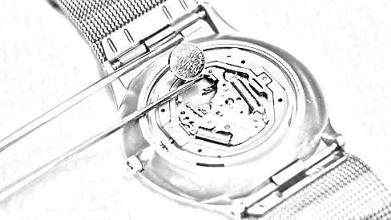
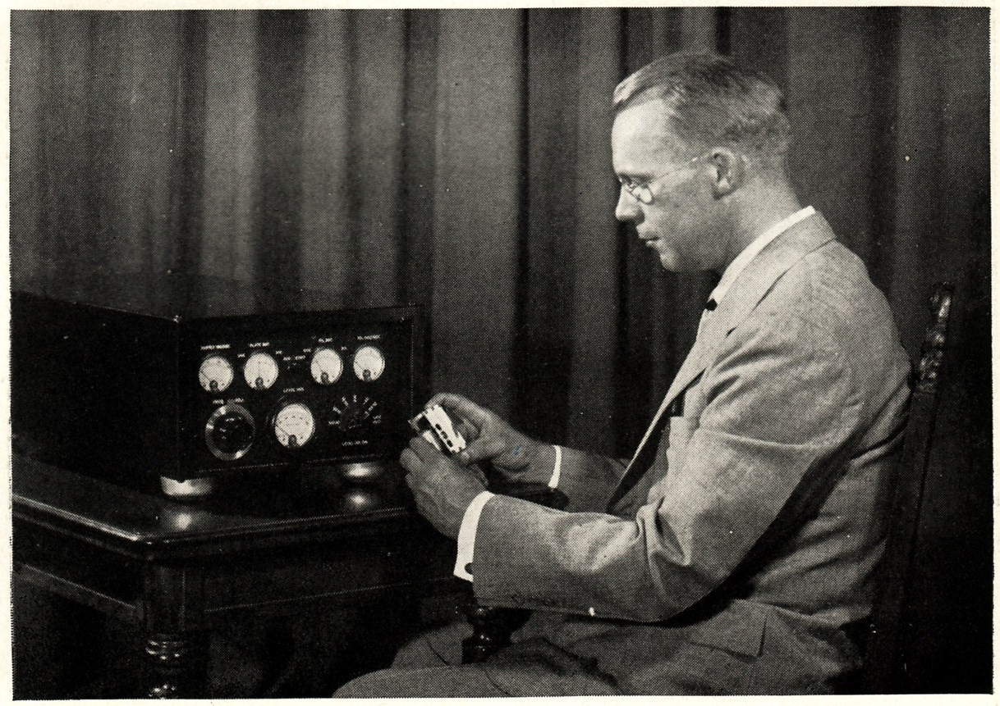
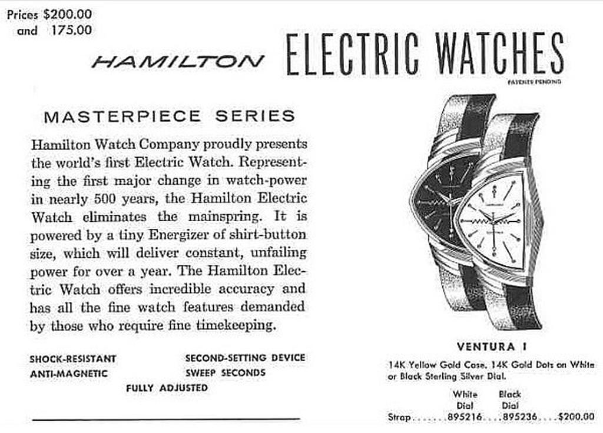
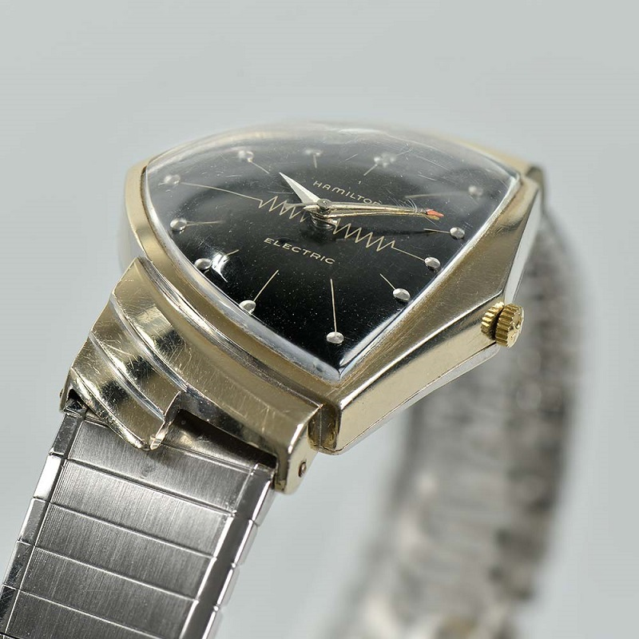
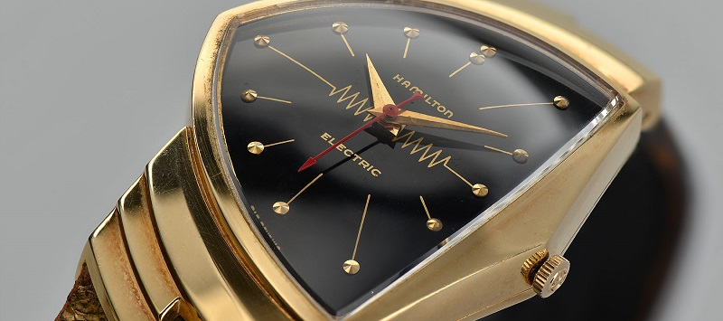
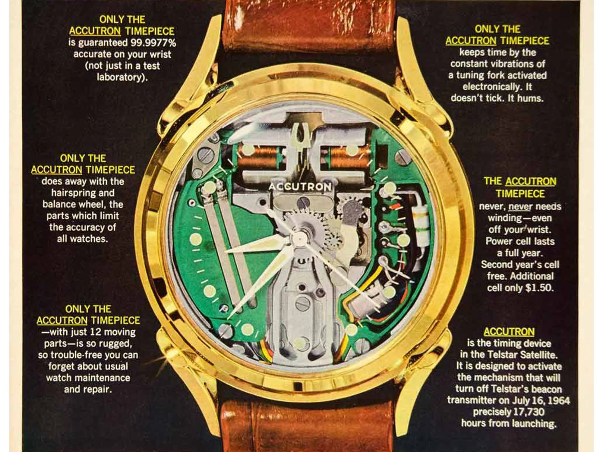
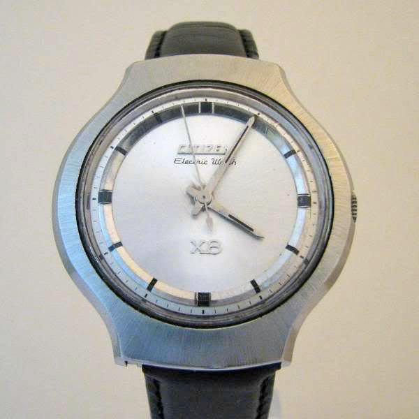
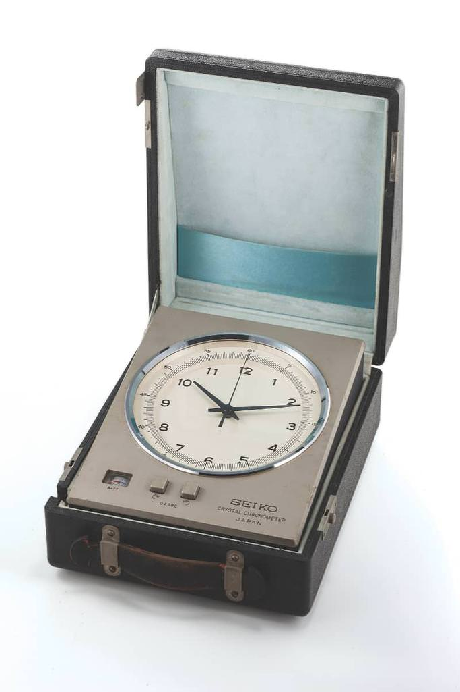
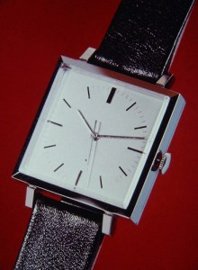

# L’orologio a batterie

## dall’Hamilton Ventura al Seiko Quartz-Astron

Il 25 dicembre **1969**, fece il debutto nei negozi di Tokyo, il **Seiko Quartz-Astron**, il primo orologio da polso analogico al quarzo. 
Ma vediamo i retroscena che hanno portato a questa rivoluzione nell’orologeria.

La prima applicazione del quarzo per il computo del tempo risale al **1927** ad opera degli americani **J. W. Horton** e **Warren A. Morrison** e la prima applicazione importante è avvenuta nell'**osservatorio di Greenwich** nel **1939**.

Come spesso accade nella tecnica, i primi apparecchi erano molto ingombranti, costosi ed inaffidabili, vediamo cosa è successo nel frattempo.

Sleghiamoci momentaneamente dal quarzo e diamo un’occhiata agli orologi a batteria.  Molti potrebbero pensare che le due cose vadano di pari passo, ma come vedremo, non è proprio così.

Gli anni ’50 furono caratterizzati da audaci sperimentazioni. 
I produttori di orologi, iniziarono a spostare l’attenzione dallo stile tradizionale e completamente meccanico dell'orologeria che aveva dominato dal 19° secolo, a nuove invenzioni che avrebbero incorporato la tecnologia elettronica che era entrando sempre più nella vita quotidiana delle persone. 
Tutto questo, però, senza dimenticare la tradizione. L’obbiettivo di quegli anni era anche di migliorare la precisione dell’orologio meccanico portandolo alla soglia dei **10 battiti al secondo**.  Verso la fine degli anni cinquanta il mercato offriva già molti orologi operanti ad una frequenza di **8 battiti al secondo**.

Fu **Hamilton**, un orologiaio americano, ad aprire la strada con l'originale **Ventura** nel **1957**.  Il movimento di quell'orologio, il **Calibro 500**, utilizzava una batteria, magneti e una bobina elettronica anziché una molla per azionare il treno di ingranaggi e il bilanciere.

### **È stato il primo orologio alimentato a batteria ed il primo a utilizzare l'energia elettrica nel suo movimento**.

`Hamilton Ventura`

Il concorrente di Hamilton, **Bulova**, guidata dal 1958 al 1973 dall'eroe della IIa Guerra Mondiale, il generale Omar Bradley, alzò la posta nel **1960**. 
Immaginato dall'ingegnere svizzero **Max Hetzel**, nacque l’**Accutron** che fu il primo orologio **completamente elettronico al mondo**.  Questo perché il cal. 500 di Hamilton incorporava componenti della meccanica classica dell’orologeria, come un *bilanciere*. 
L'Accutron, al contrario, utilizzava una **nuova tecnologia** rivoluzionaria: **un minuscolo diapason da 360 Hertz**, alimentato da un oscillatore elettronico, per azionare le funzioni di cronometraggio anziché un tradizionale bilanciere.

`Bulova Accutron Spaceview 214`

Sempre come orologio **pre quarzo**, va segnalato anche il progetto di Citizen che nel 1966 presentò **il primo orologio elettronico del Giappone** su cui ci sarebbe moltissimo da dire, ma non in questa ricerca.

### Ecco il nipponico **Citizen Electric Watch X8**.
 
`Citizen Electric Watch X8`

Sempre nel **1958** **Seiko** sviluppò un grande orologio al quarzo **delle dimensioni di un armadio**. Fu costruito specificatamente per una stazione di trasmissione. 
Il lavoro proseguì nel **1960** quando Seiko iniziò a sviluppare un orologio da tavolo per prepararsi alle Olimpiadi del 1964 a Tokyo.

Nel **1962** realizzò, inoltre, il noto **Seiko Quartz Crystal Chronometer**
 
`Seiko Quartz Crystal Chronometer`

Dopo le Olimpiadi, il marchio giapponese accelerò la miniaturizzazione del movimento al quarzo, presentando un prototipo di orologio da tasca nel **1966** ed uno di orologio da polso **1967**.

La tecnologia di **Hamilton** venne presto resa obsoleta in quanto i riflettori erano tutti puntati su **Bulova**. 
Sotto la guida di Bradley i legami di Bulova con il governo degli Stati Uniti e i suoi rami militari si rafforzarono tanto da stabilire una partnership decennale con la National Aeronautics and Space Administration (NASA).

Per contrastare il successo dell’**Accutron**, gli orologiai svizzeri, sotto la guida di **Ebauches SA** e della **Federazione svizzera dell'orologeria (FH)** fondarono nel 1962 il *Centre Electronique Horloger* **CEH** ed iniziarono a compiere ricerche per rimanere al passo con i tempi.  Se Bulova aveva affidato il progetto ad un ingegnere svizzero, la CEH, affidò la direzione del progetto ad un insegnate e ricercatore americano **Roger Wellinger** (ma che in realtà era di origini svizzere). 
Si noti, però, che nessuno dei progetti fino al 1965 prevedeva un orologio da polso al quarzo e che nel 1966 il presidente del consiglio d'amministrazione informò i due promotori del progetto dell'orologio da polso al quarzo che l'industria orologiera svizzera non era interessata a questo nuovo una specie di orologio da polso al quarzo! 
Sin dall'inizio Roger Wellinger ha riconosciuto l'importanza di un proprio laboratorio di semiconduttori.

Partirono due progetti paralleli: **Alpha** e **Beta**.
* **Alpha**, sotto la guida di** Heinz Waldburger**, stava lavorando su un regolatore sonico a forma 8. Questo sarebbe resistente all'influenza posizionale/gravitazionale, a differenza del diapason Accutron, e potrebbe sfuggire ad alcuni dei brevetti Bulova.
* **Beta**, capeggiato da **Max Forrer**, ha abbinato un diapason convenzionale a un divisore di frequenza. Ciò ha innescato un motore di vibrazione piezoelettrico o elettromagnetico, che azionava il treno di ruote, risulterebbe quindi svincolato dai brevetti Bulova.

Il 7 maggio 1965, i ricercatori **Armin Frei** e **Rolf Lochinger** erano alle prese con le sfide legate allo sviluppo di un nuovo organo oscillante.  A **Free** era stato assegnato il compito di indagare sulla ceramica piezoelettrica e sui cristalli metallici, ma i suoi pensieri si rivolsero inevitabilmente al quarzo. **Free** credeva di poter creare un cristallo di quarzo in miniatura che avrebbe vibrato più lentamente di 10 KHz, riducendo l'assorbimento di potenza del sistema. Una catena di transistor binari "flip-flop" potrebbe ridurlo a una frequenza utilizzabile, un nuovo circuito di pilotaggio potrebbe alimentarlo e il CEH potrebbe implementarlo in un circuito integrato. **Frei** e Lochinger trascorsero i sei mesi successivi a sviluppare in segreto un prototipo di oscillatore al quarzo.

I progressi della coppia hanno cambiato radicalmente la strategia della CEH. Il **26 novembre 1965** **Wellinger** dichiarò che l'obiettivo dell'organizzazione per il **1966** sarebbe stato quello di costruire un “*montre-bracelet à quartz*” o **orologio da polso al quarzo**.
Frei riuscì a creare un **oscillatore al quarzo da 8.192 Hz** nel 1966, insieme a un circuito driver e un regolatore di frequenza. Nel **1967** era in vista un orologio funzionante.
Nel frattempo, **Jean Hermann** ha creato un innovativo circuito di compensazione della temperatura.

Il movimento completo era ora conosciuto come **Beta 1**, sebbene fosse abbastanza diverso dal progetto Beta originale. 
Un prototipo con il movimento Beta 1, noto come **CEH 1020**, fu costruito da **Jean Hermann** e **François Niklès** nel **1967** e presentato per essere testato al Concorso Cronometrico Internazionale di Neuchâtel insieme ad altri prototipi successivi.

 
`1967 il *concept watch* di CEH, mai entrato in produzione`

***
***
***
***
***
***

Questo è stato il primo **movimento** per orologio da polso al quarzo al mondo, non possiamo considerarlo come primo orologio, perché ne venne prodotto un solo prototipo per i test.
l divisore di frequenza a 14 stadi utilizzato nella Beta 1 ha ridotto la frequenza a 0,5 Hz, con un motore passo-passo in stile ancora che fa avanzare il treno di ruote una volta al secondo, ma l’efficienza di questo circuito era lontano dalle aspettative.
Venne quindi creato un movimento alternativo, noto come **Beta 2**, con un semplice divisore di frequenza a 5 stadi che aziona un motore di vibrazione a 256 Hz.
Sebbene non altrettanto elegante, il design Beta 2 era sufficientemente efficiente da funzionare per oltre un anno con una singola cella della batteria.
Al concorso del 1967 furono presentati anche prototipi della Beta 2.

[IMG=Beta-1_Beta-2](assets/Beta-1_Beta-2.jpg[/IMG]

Anche Seiko presentò un suo movimento a quel concorso, ma i movimenti svizzeri Beta, conquistarono i primi 10 posti grazie soprattutto alla **termocompensazione** di **Hermann** e al **circuito di regolazione** fine di **Frei**.
Dopo la pubblicazione dei risultati del concorso di Neuchâtel, il **15 febbraio 1968**, era chiaro che il movimento CEH doveva essere messo in produzione il più rapidamente possibile, si decise di produrlo con il nome **Beta due uno** (Beta-21).
All’interno del CEH ci furono per tanti cambiamenti: nel **1976** **Armin Frei** e **Roger Wellinger** lasciarono il gruppo, seguito l’anno seguente da **Rolf Lochinger**.
Per ironia della sorte, nel **1963** **Max Hetzel** (creatore dell’Acutron) si era dimesso da Bulova nel **1963** ed era tornato in Svizzera e nel **1966** stava lavorando all'interno del CEH su un movimento migliorato del diapason.
Nel **1968** l'ETA concesse in licenza i brevetti Bulova e poco dopo fu introdotta la linea di movimenti del diapason **ETA/Derby Swissonic Mosaba**, basata sul lavoro di Hetzel al CEH.

[IMG=NYT_1968_09_12-Bulova-Patent](assets/NYT_1968_09_12-Bulova-Patent.png[/IMG]
`New York Times, 9/12/1968[/font]

Nel **1967** divenne chiaro che il CEH si sarebbe concentrato sul quarzo e Omega acquistò il lavoro di Hetzel e lì continuò a lavorare sui movimenti avanzati del diapason.
Il CEH ha completamente ridisegnato il movimento Beta 2 per creare il modello di produzione aggiungendo la complicazione del calendario, con cambio istantaneo della data e impostazione rapida premendo e ruotando la corona.

[IMG=Beta_21_1](assets/Beta_21_1.jpg[/IMG]

Il movimento Beta 21 si rivelerà **estremamente difficile** da produrre e il **22 maggio 1969** viene raggiunto un accordo per dividere la produzione tra tre aziende.

[IMG=Beta_21_2](assets/Beta_21_2.jpg[/IMG]

Il Beta 21 venne immesso in commercio nell’**aprile del 1970**.

In quegli anni, tutte le principali case erano in corsa per realizzare in primo **Orologio al quarzo**.
**Longines** cercò di battere tutti sul tempo annunciando l’imminente realizzazione di un orologio a quarzo il **20 agosto 1969** durante una conferenza stampa a Ginevra.
Questo avveniva ben **8 mesi** prima della produzione del Beta 21 e **4 mesi** prima dell’immissione sul mercato del **Seiko Astron**.

[IMG=Ultra_Quartz_1](assets/Ultra_Quartz_1.png[/IMG]

Longines sviluppò il suo primo cronometro al quarzo interno (un modello di grandi dimensioni con montaggio su rack) nel **1954** e divenne il più preciso mai registrato dall'**Osservatorio di Neuchâtel**. Nel **1966 **l'azienda ha miniaturizzato questa tecnologia trasformandola in un cronometro da tasca.
L'**Ultra-Quartz** è stato il primo orologio svizzero al quarzo **annunciato**. Veniva chiamato “*cibernetico*”, si basa sull'interazione di due oscillatori. Un quarzo da 9.350 Hz è il cronometrista principale, mentre un motore di vibrazione funziona più lentamente e aziona il ruotismo in modo simile al movimento di un diapason. Ciascun oscillatore fornisce feedback all'altro, regolando il cronometraggio.

[IMG=Ultra_quartz_2](assets/Ultra_quartz_2.png[/IMG]

Questo design assomigli a quello adottato sul **Bulova Accuquartz** nel**1971 **. Quest'ultimo diventerà il primo orologio al quarzo **venduto negli Stati Uniti**.
L'**Ultra-Quartz** non utilizza circuiti integrati, poiché Longines non disponeva di questa capacità tecnica. Sfrutta invece 30-40 componenti elettronici in miniatura, un design costoso e impegnativo simile ai cronometri da competizione Seiko del 1967. Questo movimento è stato sviluppato internamente dal **Longines**, la maison faceva parte anche del consorzio CEH.

[IMG=Ultra_quartz_3](assets/Ultra_quartz_3.png[/IMG]

L'**Ultra-Quartz**, annunciato il **20 agosto 1969**, non è chiaro quando venne prodotto. Alcune fonti riferiscono che l’anno di uscita sia però il **1971**.

Ricapitolando:
➥ il primo **movimento** per orologio da polso al quarzo al mondo fu il **Beta 1** nel 1967
➥ il primo orologio svizzero al quarzo **annunciato** fu l’**Ultra-Quartz** il 20 agosto 1969
➥ il primo **movimento** per orologio da polso al quarzo svizzero **prodotto** fu il **Beta 21** nell’aprile del 1970

Ma quale fu il primo orologio da polso **prodotto**?
Il giorno di **Natale del 1969**, un evento sconvolgente per l’intero mondo dell’orologeria avvenne in **Giappone**: il primo orologio da polso al quarzo fece il suo debutto nei negozi di Tokyo, innescando la più lunga e devastante crisi per il mercato svizzero.

[IMG=quartz-astron-35sq-35sqc-768x611]https://upload.forumfree.net/i/ff14066840/Vario_Ricerche/Cronografo/quartz-astron-35sq-35sqc-768x611.jpg[/IMG]
`Seiko Quartz-Astron ref. 35SQ (destra) e ref. 35SQC (sinistra)[/font]

Giusto per completezza, facciamo un balzo in avanti fino al **1972**, per l’esattezza nel mese di Aprile, quando il primo vero orologio **digitale** al quarzo venne alla luce. Ovviamente parliamo dell’iconico **Hamilton Pulsar P1**.
Credo che tutti qui conoscano questo iconico orologio con un display a led rossi realizzato da un circuito con ben 25 chip, realizzato con cassa e bracciale in oro 18K.

[IMG=1972-Pulsar_P1](assets/1972-Pulsar_P1.png[/IMG]
`Pulsar P1 - 1792[/font]

e la versione in acciaio del 1973:

[IMG=1973-Pulsar_P2](assets/1973-Pulsar_P2.png[/IMG]
`Pulsar P2 - 1793[/font]

Sempre nel **1973**, vedrà la luce il primo orologio **con display LED** al mondo dovrebbe essere stato prodotto da **Seiko** con il modello **LC V.F.A. 06LC**.

[IMG=Seiko_06LC](assets/Seiko_06LC.png[/IMG]
`Seiko 06LC[/font]

Ci sono però teorie che assegnano il primato al **Gruen Teletime LCD Watch** che viene datato **1972**, pertanto un anno prima di Seiko. Questo segnatempo era animato da un movimento Gruen 606°.

[IMG=Gruen-Teletime-606A-1](assets/Gruen-Teletime-606A-1.jpg[/IMG]
[IMG=Gruen-Teletime-606A-3](assets/Gruen-Teletime-606A-3.jpg[/IMG]
[IMG=Gruen-Teletime-606A-0](assets/Gruen-Teletime-606A-0.jpg[/IMG]
` Gruen Teletime LCD Watch [/font]

[font=Courier][color=yellow]**aggiunta del 23.08.2024**[/font]
Da non amante del marchio coronato, non mi ero nemmeno interessato a come rispose alla *crisi del quarzo*, oltretutto non è nemmeno oggetto di questa ricerca, ma visto che Enrico aveva redatto una ricerca [url=https://watch.forumfree.it/?t=75207763#entry616782926]leggibile seguendo questo :link:[/url], rendo noto che nel 1977 nacque il Rolex Oysterquartz.
[img]https://upload.forumfree.net/i/ff10507703/Rolex_Datejust_Oysterquartz_0.jpg[/img]
`Rolex Datejust Oysterquartz - ref. 5100 - cal. Beta 21[/font][/center]

[size=8]conclusione[/size]

[size=8]La corsa alla realizzazione del **primo orologio da polso** meccanico al quarzo, fu vinta in Giappone da **Seiko**.[/size]

